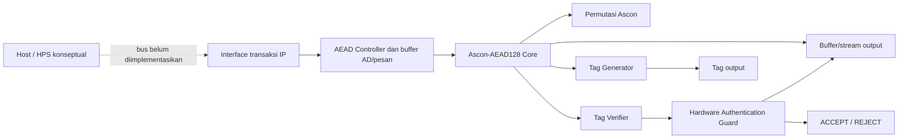

# SECURE-TINY

**Perancangan IP Core Authenticated Encryption Hemat Sumber Daya dengan Hardware Authentication Guard untuk Komunikasi Edge Aman**

SECURE-TINY adalah IP accelerator authenticated encryption/decryption berbasis **Ascon-AEAD128** sesuai NIST SP 800-232 final. Tantangan utama proyek adalah **Hardware Cryptography Accelerator**, dengan **Secure Communication** sebagai tantangan pendukung dan **DE10-Nano FPGA/SoC** sebagai target evaluasi.

Proyek memusatkan kerja pada datapath RTL dan bukti fungsional. Klaim efisiensi belum dibuat karena resource dan timing FPGA belum diukur. Status pengujian dan batas hasil terbaru ada di [`docs/results.md`](docs/results.md); ruang lingkup dan requirement proyek ada di [`docs/PRD.md`](docs/PRD.md).

Draf proposal teknis tersedia di [`docs/proposal-draft.md`](docs/proposal-draft.md). Peta fungsi file dan komunikasi antarmodul tersedia di [`docs/file-map-and-integration.md`](docs/file-map-and-integration.md). Hasil Quartus yang belum tersedia ditandai TBD.

## Latar belakang dan ruang lingkup

Perangkat edge dan IoT perlu melindungi kerahasiaan data sekaligus mendeteksi perubahan pada pesan dan metadata terkait. SECURE-TINY menguji fungsi itu sebagai IP authenticated-encryption berbasis Ascon-AEAD128. Tantangan utamanya **Hardware Cryptography Accelerator**; **Secure Communication** menjadi fokus pendukung. Proyek ini belum mencakup secure element lengkap, protokol jaringan, key exchange, bus HPS/Avalon, atau sensor tamper fisik.

PRD mengacu pada NIST SP 800-232 final. Ascon-AEAD128 adalah algoritma standar yang digunakan; kebaruan proyek adalah integrasi IP modular dan guard keluaran dekripsi yang menahan plaintext sampai autentikasi berhasil, bukan algoritma kriptografi baru.

## Fitur dan status saat ini

- Permutasi Ascon iteratif: satu ronde per siklus aktif.
- Enkripsi dan dekripsi Ascon-AEAD128 dalam core buffered.
- Input AD dan pesan byte-wide dengan handshake `valid/ready`.
- Tag generator, pembanding tag 128-bit, dan authentication guard.
- Plaintext dekripsi baru tersedia sesudah tag terverifikasi; tag/ciphertext salah ditolak tanpa mengeluarkan plaintext.
- Testbench core membandingkan RTL dengan 1.089 record KAT Ascon-C v1.3.0 untuk enkripsi dan dekripsi (2.178 transaksi, testbench berkapasitas 32 byte).
- Testbench top-level menggunakan kapasitas 16 byte sesuai profil proyek Quartus; 289 pasangan panjang AD/pesan diuji untuk encrypt dan decrypt (578 transaksi).
- Controller menampung seluruh AD dan pesan sebelum memulai core; ini bukan accelerator streaming kontinu.

> KAT Ascon-C dipakai sebagai uji tambahan. Acuan algoritma proyek adalah NIST SP 800-232 final. Checker Python juga membandingkan model dengan 14 kasus byte-aligned dari sampel ACVP NIST; hasil Python tersebut bukan pengganti uji RTL.

## Arsitektur sistem



Top-level RTL saat ini adalah interface sinkron board-independent. `secure_tiny_top` menerima perintah, key/nonce, panjang AD/pesan, stream AD/pesan, dan untuk dekripsi tag yang diterima. Transfer byte terjadi saat `valid && ready` pada tepi naik clock. `MAX_DATA_BYTES` adalah batas untuk AD dan pesan secara terpisah. Build DE10-Nano menetapkan 16 byte.

Saat enkripsi, core menghasilkan ciphertext dan tag. Saat dekripsi, calon plaintext tetap tertahan sampai tag cocok; jika tidak cocok, guard menolak dan tidak ada byte plaintext valid. Antarmuka HPS/Avalon, DMA, dan pemetaan pin untuk data transaksi belum dibuat. QSF menggunakan virtual pins untuk sinyal transaksi, sehingga preflight Quartus tidak berarti interface sudah bisa diuji dari papan.

### Modul RTL

| Modul | Fungsi |
|---|---|
| `ascon_permutation.sv` | Permutasi state 320-bit; menerima konfigurasi ronde dan memberikan status selesai/error. |
| `ascon_core.sv` | Mengolah inisialisasi, AD, pesan, finalisasi, output data, dan tag. |
| `aead_controller.sv` | Mengatur satu transaksi, menerima stream ke buffer, menjalankan core, mengatur verifikasi dan handshake output. |
| `tag_generator.sv` | Menahan tag hasil sampai konsumen menerima tag. |
| `tag_verifier.sv` | Membandingkan seluruh 128 bit tag dan melaporkan match/mismatch. |
| `authentication_guard.sv` | Menyimpan keputusan autentikasi dan mengizinkan plaintext hanya jika dekripsi lolos verifikasi. |
| `secure_tiny_top.sv` | Menggabungkan modul menjadi satu IP dengan interface sinkron. |
| `counter.sv` | Contoh pembelajaran counter; bukan bagian datapath AEAD. |

## Toolchain dan software

- **OSS CAD Suite for Windows**: paket tool lokal; runner memakai `iverilog`, `vvp`, Yosys, dan Python dari suite.
- **Icarus Verilog**: compile dan simulasi SystemVerilog testbench.
- **Verilator**: lint/elaborasi statis top-level RTL untuk pemeriksaan tambahan.
- **GTKWave**: melihat file waveform VCD.
- **Yosys**: sintesis generik RTL untuk pemeriksaan struktur.
- **Intel Quartus Prime Lite**: mendukung Cyclone V; diperlukan untuk compile target, laporan resource/timing, dan pembuatan `.sof`; belum tersedia pada sesi verifikasi yang tercatat.
- **Python**: model referensi dan checker vector.
- **VS Code**: editor yang dapat dipakai untuk melihat RTL, skrip, dan dokumen.
- **Git**: version control untuk perubahan source dan dokumentasi.

Runner membutuhkan OSS CAD Suite. Atur `$env:OSS_CAD_SUITE` ke lokasi instalasi atau berikan parameter `-SuiteRoot`; source tidak menyimpan path workstation tertentu.

## Penggunaan

### 1. Buka PowerShell di folder proyek

```powershell
Set-Location '<path-to-project>\SECURE-TINY'
$env:OSS_CAD_SUITE = 'C:\tools\oss-cad-suite'
```

Ganti path jika proyek atau OSS CAD Suite berada di lokasi lain.

### 2. Jalankan seluruh simulasi dan pembanding referensi

```powershell
powershell.exe -NoProfile -ExecutionPolicy Bypass -File .\scripts\run_all_tests.ps1
```

Suite menjalankan counter, permutasi, core KAT RTL, unit tag/guard, top-level directed tests, sweep KAT pada top-level, checker Python ACVP, dan checker KAT Python. Exit code selain nol atau pesan `$fatal` berarti run gagal. Icarus dapat menampilkan peringatan `constant selects in always_*`; catat peringatan tersebut dan jangan menafsirkannya sebagai hasil sintesis Quartus.

Runner individual tersedia di `scripts/run_counter.ps1`, `run_ascon_permutation.ps1`, `run_ascon_core.ps1`, `run_tag_auth_modules.ps1`, `run_secure_tiny_top.ps1`, `run_secure_tiny_kat.ps1`, dan `run_python_reference.ps1`.

### 3. Jalankan lint dan periksa sintesis/preflight FPGA

```powershell
powershell.exe -NoProfile -ExecutionPolicy Bypass -File .\scripts\lint_verilator.ps1 -MaxDataBytes 16
powershell.exe -NoProfile -ExecutionPolicy Bypass -File .\scripts\synth_yosys.ps1 -MaxDataBytes 16
powershell.exe -NoProfile -ExecutionPolicy Bypass -File .\scripts\check_quartus_project.ps1
```

Lint Verilator memeriksa elaborasi dan peringatan RTL, tetapi tidak membuktikan hasil Quartus atau perilaku kriptografi. Runner memakai `bin\verilator_bin.exe` dari OSS CAD Suite dan mengatur `VERILATOR_ROOT` serta `PATH` secara lokal.

Sintesis generik menghasilkan log `sim/yosys_secure_tiny_16.log`. Angka 20.887 sel yang tercatat merupakan **sel generik Yosys**, bukan ALM/LE Cyclone V. Preflight hanya memeriksa konsistensi berkas dan assignment statis.

Setelah Intel Quartus Prime yang mendukung Cyclone V dipasang dan `quartus_sh` tersedia di `PATH`, jalankan:

```powershell
powershell.exe -NoProfile -ExecutionPolicy Bypass -File .\scripts\build_quartus.ps1
```

Jika Quartus sudah terpasang tetapi belum ada di `PATH`, berikan path executable secara langsung:

```powershell
powershell.exe -NoProfile -ExecutionPolicy Bypass -File .\scripts\build_quartus.ps1 -QuartusSh 'C:\path\to\quartus_sh.exe'
```

Untuk menjalankan `quartus_map`, `quartus_fit`, `quartus_sta` dan mengekstrak ALM/register/Fmax dari laporan `.rpt`:

```powershell
powershell.exe -NoProfile -ExecutionPolicy Bypass -File .\scripts\build_quartus_metrics.ps1
```

Jika tools Quartus tidak ada di `PATH`, berikan folder `bin64` melalui `-QuartusBin`. Hasil log dan CSV metrik dibuat di folder `quartus/`; nilai yang tidak terdeteksi akan tetap ditandai `TBD`/`UNPARSED`. Script ini tidak membuat `.sof`; jalankan Assembler setelah fit berhasil.

Hanya laporan compile Quartus yang sukses boleh dipakai untuk mengisi resource, timing, dan pembuatan programming file FPGA.

### 4. Buka waveform dengan GTKWave

Testbench menghasilkan VCD di `sim/`. Untuk top-level:

```powershell
& "$env:OSS_CAD_SUITE\bin\gtkwave.exe" .\sim\secure_tiny_top.vcd
```

Waveform lainnya: `counter.vcd`, `ascon_permutation.vcd`, `ascon_core.vcd`, `tag_auth_modules.vcd`, dan `secure_tiny_kat.vcd`. Jika executable GTKWave memiliki nama/lokasi berbeda pada paket Anda, buka file VCD melalui menu **File → Open**.

## Hasil verifikasi yang tercatat

Run lokal 1 Oktober 2026 menunjukkan semua test script PASS. Core RTL cocok dengan seluruh 1.089 record Ascon-C KAT pada kedua mode (2.178 transaksi; total 121.308 siklus; maksimum 88). Top-level juga mencocokkan 289 pasangan panjang AD/pesan hingga 16 byte untuk enkripsi dan dekripsi (578 transaksi; maksimum 150 siklus termasuk input stream). Model Python cocok dengan 14 sampel byte-aligned ACVP dan seluruh KAT. Rincian versi tool, sumber vector, hash, batas klaim, dan hasil tiap skenario ada di [`docs/results.md`](docs/results.md).

Pada 1 Oktober 2026, lint Verilator 5.053 untuk top-level dengan `MAX_DATA_BYTES=16` juga lulus tanpa warning; ini pemeriksaan elaborasi/lint, bukan compile Quartus.

**Belum diukur/dibuat:** resource Cyclone V, Fmax/timing FPGA, file `.sof`, throughput pada hardware, dan uji DE10-Nano. Interface host transaksi juga belum terintegrasi. Tidak ada klaim board test atau fabrikasi ASIC.

## Peta repositori

```text
SECURE-TINY/
├── docs/       PRD, arsitektur, spesifikasi modul, verifikasi, hasil, proposal
├── quartus/    QPF/QSF/SDC untuk target Cyclone V DE10-Nano
├── rtl/        RTL SystemVerilog synthesizable
├── scripts/    runner simulasi/lint, sintesis Yosys, preflight dan build Quartus
├── sim/        VCD dan log hasil tool; file .vvp sementara dapat dibuat ulang
├── tb/         testbench counter, permutasi, core, tag/guard, dan top-level
├── python/     model Ascon dan pembanding vector
└── vectors/    sampel ACVP NIST dan supplemental KAT Ascon-C
```

`docs/PRD.md` berisi spesifikasi utama; `PRD.md` di root menyediakan versi berbahasa Indonesia. Dokumen arsitektur, spesifikasi modul, verifikasi, hasil, dan peta file tersedia di `docs/`.

## Rencana pengembangan

1. Jalankan Quartus Prime Lite pada Cyclone V dan simpan hasil Fitter serta Timing Analyzer.
2. Tentukan interface host dan pemetaan pin fisik sebelum uji transaksi pada DE10-Nano.
3. Rancang dan verifikasi zeroization jika menjadi requirement produk.
4. Lakukan evaluasi side-channel dan fault/tamper fisik sebelum membuat klaim ketahanan terhadap serangan tersebut.

## Lisensi dan atribusi

Source code dan dokumentasi SECURE-TINY dilisensikan di bawah [MIT License](LICENSE). Vektor uji pihak ketiga disertakan untuk reproduksibilitas dan tetap tunduk pada ketentuan sumber masing-masing. KAT Ascon-C v1.3.0 berasal dari repositori upstream berlisensi CC0-1.0 ([lisensi upstream](https://github.com/ascon/ascon-c/blob/v1.3.0/LICENSE)); lisensi proyek tidak mengubah lisensi atau atribusi materi pihak ketiga. Sumber dan identitas vector dicatat di [`docs/verification.md`](docs/verification.md) dan [`docs/results.md`](docs/results.md).

## Referensi utama

1. NIST, [SP 800-232 final: Ascon-Based Lightweight Cryptography Standards for Constrained Devices](https://csrc.nist.gov/pubs/sp/800/232/final), 2025.
2. NIST, [Lightweight Cryptography publications and standardization information](https://csrc.nist.gov/Projects/lightweight-cryptography/publications).
3. NIST ACVP Server, [sample vectors Ascon-AEAD128 SP800-232](https://github.com/usnistgov/ACVP-Server/tree/master/gen-val/json-files/Ascon-AEAD128-SP800-232).
4. Ascon team, [ascon-c source and release history](https://github.com/ascon/ascon-c), termasuk KAT tambahan yang versinya dicatat di `docs/results.md`.
5. Terasic, [DE10-Nano product page and user manual](https://www.terasic.com.tw/cgi-bin/page/archive.pl?CategoryNo=204&Language=English&No=1046&PartNo=4).
6. Intel, [Quartus Prime User Guide: Getting Started](https://www.intel.com/content/www/us/en/docs/programmable/683475.html).

Tanggal akses referensi daring: 30 September 2026.
