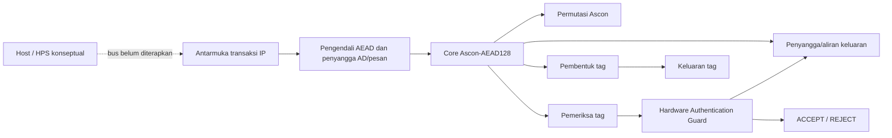

# SECURE-TINY

**Perancangan IP Core Authenticated Encryption Hemat Sumber Daya dengan Hardware Authentication Guard untuk Komunikasi Edge Aman**

Kami mengembangkan SECURE-TINY sebagai IP akselerator untuk enkripsi/dekripsi terautentikasi berbasis **Ascon-AEAD128** sesuai NIST SP 800-232 final. Kami memilih **Hardware Cryptography Accelerator** sebagai tantangan utama, **Secure Communication** sebagai tantangan pendukung, dan **DE10-Nano FPGA/SoC** sebagai target evaluasi.

Repositori proyek: [github.com/Ripanrz/secure-tiny](https://github.com/Ripanrz/secure-tiny).

Kami memusatkan pekerjaan pada jalur data RTL dan bukti fungsional. Build Quartus kami kini memberi baseline 2.464 ALM dan Fmax 79,72 MHz untuk konfigurasi 16 byte; kami belum mengklaim efisiensi komparatif, dan analisis I/O belum lengkap karena port transaksi memakai virtual pins. Kami mencatat bukti dan batas hasil di [`docs/results.md`](docs/results.md), serta ruang lingkup di [`docs/PRD.md`](docs/PRD.md).

**Status kerja:** kami telah menyelesaikan kompilasi penuh Quartus Prime Lite 25.1 untuk Cyclone V `5CSEBA6U23I7`, termasuk Fitter, Timing Analyzer, Assembler, dan berkas `.sof`. Kami menunda pengujian fisik DE10-Nano serta integrasi antarmuka transaksi host karena belum tersedia board dan jalur fisik transaksi. Quartus terpasang di `C:\altera_lite\25.1std`; detail hasil serta peringatannya ada di [`docs/results.md`](docs/results.md).

Kami menyimpan draf proposal teknis di [`docs/proposal-draft.md`](docs/proposal-draft.md) dan peta fungsi file serta komunikasi antarmodul di [`docs/file-map-and-integration.md`](docs/file-map-and-integration.md). Kami menandai hasil yang belum diukur—misalnya daya dan kinerja pada board—sebagai TBD.

Kami menyusun draf proposal mengikuti lima bagian yang diminta kompetisi: ringkasan ide, latar belakang dan rumusan masalah, rancangan chip, referensi, serta lampiran. Kami membiarkan identitas tim dan pembagian peran sebagai isian sampai data sebenarnya tersedia.

## Latar belakang dan ruang lingkup

Kami berangkat dari kebutuhan perangkat edge dan IoT untuk melindungi kerahasiaan data serta mendeteksi perubahan pada pesan dan metadata. Kami menguji fungsi tersebut melalui IP enkripsi terautentikasi berbasis Ascon-AEAD128. Fokus utama kami adalah **Hardware Cryptography Accelerator**, dengan **Secure Communication** sebagai fokus pendukung. Cakupan kami belum meliputi elemen keamanan lengkap, protokol jaringan, pertukaran kunci, bus HPS/Avalon, atau sensor gangguan fisik.

Kami mengacu pada NIST SP 800-232 final untuk Ascon-AEAD128. Kami belum mengklaim kebaruan yang terbukti; integrasi IP modular dan penjagaan keluaran dekripsi merupakan fokus implementasi yang masih perlu kami bandingkan dengan karya terdahulu dan ukur pada target FPGA.

### Dasar keamanan rancangan

Kami menjadikan keamanan sebagai batas arsitektur: plaintext dekripsi tidak boleh keluar sebelum tag cocok, dan transaksi yang ditolak tidak boleh mentransfer plaintext. Kami memperlakukan key, state internal, dan calon plaintext sebagai aset. Pemanggil bertanggung jawab atas nonce; kami belum menerapkan atau membuktikan pembersihan semua salinan rahasia, mitigasi side-channel, perlindungan fault injection, maupun deteksi gangguan fisik. Kami menguji penahanan plaintext pada skenario simulasi yang tercatat dan menjelaskan cakupan serta batas klaim di [`docs/PRD.md`](docs/PRD.md), [`docs/verification.md`](docs/verification.md), dan [`docs/results.md`](docs/results.md).

## Fitur dan status saat ini

- Kami menjalankan permutasi Ascon secara iteratif, satu ronde per siklus aktif.
- Kami menerapkan enkripsi dan dekripsi Ascon-AEAD128 dalam core dengan penyangga.
- Kami menerima AD dan pesan per byte melalui handshake `valid/ready`.
- Kami menggunakan pembentuk tag, pembanding tag 128-bit, dan Hardware Authentication Guard.
- Kami hanya mengizinkan plaintext dekripsi keluar setelah tag terverifikasi; uji kami menolak tag/ciphertext salah tanpa mengeluarkan plaintext.
- Kami menguji perubahan AD saja dengan ciphertext dan tag KAT tetap; transaksi tersebut ditolak tanpa plaintext.
- Kami membandingkan core RTL dengan 1.089 rekaman KAT Ascon-C v1.3.0 pada enkripsi dan dekripsi (2.178 transaksi; kapasitas testbench 32 byte).
- Kami menguji 289 pasangan panjang AD/pesan pada kedua mode melalui top-level berkapasitas 16 byte (578 transaksi).
- Kami menampung seluruh AD dan pesan sebelum core mulai, sehingga rancangan kami belum menjadi akselerator aliran data kontinu.

> Kami memakai KAT Ascon-C sebagai uji tambahan dan NIST SP 800-232 final sebagai acuan algoritma. Pemeriksa Python membandingkan model dengan 14 kasus berukuran kelipatan byte dari sampel ACVP NIST; hasil Python ini tidak menggantikan uji RTL.

## Arsitektur sistem



Kami menyediakan antarmuka RTL tingkat atas sinkron yang tidak bergantung pada board. `secure_tiny_top` menerima perintah, key/nonce, panjang AD/pesan, aliran AD/pesan, dan tag untuk dekripsi. Byte berpindah saat `valid && ready` pada tepi naik clock. `MAX_DATA_BYTES` membatasi panjang AD dan pesan secara terpisah; konfigurasi DE10-Nano menetapkan kapasitas 16 byte.

Pada enkripsi, core kami menghasilkan ciphertext dan tag. Pada dekripsi, kami menahan calon plaintext sampai tag cocok; jika tidak cocok, guard menolak dan tidak menyatakan byte plaintext valid. Kami belum membuat antarmuka HPS/Avalon, DMA, atau pemetaan pin transaksi. QSF memakai pin virtual untuk sinyal transaksi, sehingga preflight Quartus tidak berarti kami dapat menguji antarmuka dari board.

### Modul RTL

| Modul | Fungsi |
|---|---|
| `ascon_permutation.sv` | Permutasi state 320-bit; menerima konfigurasi ronde dan memberikan status selesai/error. |
| `ascon_core.sv` | Mengolah inisialisasi, AD, pesan, finalisasi, data keluaran, dan tag. |
| `aead_controller.sv` | Mengatur satu transaksi, menerima aliran data ke penyangga, menjalankan core, serta mengatur verifikasi dan handshake keluaran. |
| `tag_generator.sv` | Menahan tag hasil sampai konsumen menerima tag. |
| `tag_verifier.sv` | Membandingkan seluruh 128 bit tag dan melaporkan match/mismatch. |
| `authentication_guard.sv` | Menyimpan keputusan autentikasi dan mengizinkan plaintext hanya jika dekripsi lolos verifikasi. |
| `secure_tiny_top.sv` | Menggabungkan modul menjadi satu IP dengan antarmuka sinkron. |
| `counter.sv` | Contoh pembelajaran pencacah; bukan bagian jalur data AEAD. |

## Perangkat pengembangan dan perangkat lunak

- **OSS CAD Suite for Windows**: kami gunakan sebagai paket perangkat lokal; skrip pengujian mengambil `iverilog`, `vvp`, Yosys, dan Python dari paket tersebut.
- **Icarus Verilog**: kami gunakan untuk mengompilasi dan menyimulasikan testbench SystemVerilog.
- **Verilator**: kami gunakan untuk lint/elaborasi statis RTL tingkat atas.
- **GTKWave**: kami gunakan untuk melihat waveform VCD.
- **Yosys**: kami gunakan untuk sintesis generik dan pemeriksaan struktur RTL.
- **Intel Quartus Prime Lite 25.1 untuk Windows**: kami menjalankan build untuk `5CSEBA6U23I7`; laporan Fitter, Timing Analyzer, dan `.sof` tersedia secara lokal di `quartus/output_files/`.
- **Python**: kami gunakan untuk model referensi dan pemeriksa vektor.
- **VS Code**: kami gunakan untuk membaca dan menyunting RTL, skrip, dan dokumen.
- **Git**: kami gunakan untuk mengelola versi source dan dokumentasi.

Kami menjalankan skrip pengujian dengan OSS CAD Suite. Atur `$env:OSS_CAD_SUITE` ke lokasi instalasi atau berikan parameter `-SuiteRoot`; kami tidak menyimpan jalur khusus workstation di dalam kode sumber.

## Penggunaan

### 1. Buka PowerShell di folder proyek

```powershell
Set-Location '<path-to-project>\secure-tiny'
$env:OSS_CAD_SUITE = 'C:\tools\oss-cad-suite'
```

Jika direktori proyek atau OSS CAD Suite kami berbeda, kami menyesuaikan jalur pada perintah tersebut.

### 2. Jalankan seluruh simulasi dan pembanding referensi

```powershell
powershell.exe -NoProfile -ExecutionPolicy Bypass -File .\scripts\run_all_tests.ps1
```

Dengan rangkaian ini, kami menguji counter, permutasi, KAT core RTL, unit tag/guard, uji terarah dan sapuan KAT tingkat atas, serta pemeriksa Python ACVP/KAT. Kode keluar selain nol atau pesan `$fatal` berarti pengujian gagal. Icarus dapat menampilkan peringatan `constant selects in always_*`; kami mencatatnya sebagai peringatan simulator, bukan hasil sintesis Quartus.

Runner individual tersedia di `scripts/run_counter.ps1`, `run_ascon_permutation.ps1`, `run_ascon_core.ps1`, `run_tag_auth_modules.ps1`, `run_secure_tiny_top.ps1`, `run_secure_tiny_kat.ps1`, dan `run_python_reference.ps1`.

### 3. Jalankan lint dan periksa sintesis/preflight FPGA

```powershell
powershell.exe -NoProfile -ExecutionPolicy Bypass -File .\scripts\lint_verilator.ps1 -MaxDataBytes 16
powershell.exe -NoProfile -ExecutionPolicy Bypass -File .\scripts\synth_yosys.ps1 -MaxDataBytes 16
powershell.exe -NoProfile -ExecutionPolicy Bypass -File .\scripts\check_quartus_project.ps1
```

Kami memakai lint Verilator untuk memeriksa elaborasi dan peringatan RTL; lint tidak membuktikan hasil Quartus atau kebenaran kriptografi. Skrip mengambil `bin\verilator_bin.exe` dari OSS CAD Suite dan mengatur `VERILATOR_ROOT` serta `PATH` secara lokal.

Kami menyimpan log sintesis generik di `sim/yosys_secure_tiny_16.log`. Angka 20.887 sel merupakan **sel generik Yosys**, bukan ALM/LE Cyclone V. Pemeriksaan awal kami hanya memeriksa konsistensi berkas dan penetapan statis.

Pada lingkungan build kami, Quartus/Tcl salah menormalisasi path langsung di bawah folder profil Windows. Karena itu, kami memetakan root repositori ke drive sementara `R:` sebelum menjalankan build penuh:

```powershell
subst R: 'C:\Users\arpan\Downloads\chipset_peruri\secure-tiny'
Push-Location R:\quartus
try {
    powershell.exe -NoProfile -ExecutionPolicy Bypass -File R:\scripts\build_quartus.ps1 -QuartusSh 'C:\altera_lite\25.1std\quartus\bin64\quartus_sh.exe'
} finally {
    Pop-Location
    subst R: /d
}
```

Untuk menjalankan ulang `quartus_map`, `quartus_fit`, `quartus_sta`, serta mengambil ALM/register/Fmax dari laporan `.rpt`, gunakan pemetaan drive yang sama:

```powershell
subst R: 'C:\Users\arpan\Downloads\chipset_peruri\secure-tiny'
Push-Location R:\quartus
try {
    powershell.exe -NoProfile -ExecutionPolicy Bypass -File R:\scripts\build_quartus_metrics.ps1 -QuartusBin 'C:\altera_lite\25.1std\quartus\bin64'
} finally {
    Pop-Location
    subst R: /d
}
```

Skrip metrik menerima folder `bin64` melalui `-QuartusBin`; kami menggunakannya jika Quartus belum ada di `PATH`. Log dan CSV metrik akan dibuat di folder `quartus/`; nilai yang tidak terdeteksi tetap ditandai `TBD`/`UNPARSED`. Skrip ini tidak membuat `.sof`; kami perlu menjalankan Assembler setelah proses fit berhasil.

Hanya laporan kompilasi Quartus yang sukses boleh dipakai untuk mengisi data resource, timing, dan pembuatan berkas pemrograman FPGA.

#### Build Quartus dan batas pengujian board

Kami telah menjalankan build penuh. Fitter melaporkan 2.464 ALM (6%), 2.800 register, Fmax 79,72 MHz, dan setup slack +7,456 ns pada clock target 50 MHz. Kami belum menganggap timing I/O selesai karena port transaksi memakai virtual pins dan Timing Analyzer menandai desain belum sepenuhnya constrained.

Kami menggunakan [Quartus Prime Lite Edition 25.1 untuk Windows](https://www.altera.com/downloads/fpga-development-tools/quartus-prime-lite-edition-design-software-version-25-1-windows) beserta paket dukungan Cyclone V. Instalasi kami sudah tersedia di `C:\altera_lite\25.1std`; daftar komponen berikut kami catat untuk dokumentasi konfigurasi:

1. perangkat lunak Quartus Prime Lite;
2. dukungan perangkat **Cyclone V** (`cyclonev-25.1std.0.1129.qdz` pada paket 25.1).

Kami memilih edisi Lite karena mendukung Cyclone V untuk alur yang dibutuhkan proyek. Kami tidak memerlukan edisi Standard atau Pro untuk target ini. [Matriks edisi dan perangkat Quartus](https://www.intel.com/content/www/us/en/products/details/fpga/development-tools/quartus-prime/resource.html) · [Paket dukungan Cyclone V 25.1](https://www.altera.com/downloads/fpga-development-tools/quartus-prime-lite-edition-design-software-version-25-1-windows).

Executable yang kami gunakan berada di `C:\altera_lite\25.1std\quartus\bin64`. Kami mencantumkan perintah build yang berhasil dan cara mengulangnya pada bagian penggunaan di atas, serta menyimpan rincian run di [`docs/results.md`](docs/results.md). Skrip `build_quartus.ps1` menjalankan alur kompilasi penuh; skrip ekstraksi metrik terpisah menjalankan ulang map/fit/timing dan tidak membuat `.sof` sendiri. Build ini belum menambahkan jalur transaksi host ke desain kami: port transaksi masih berupa virtual pins.

### 4. Buka waveform dengan GTKWave

Testbench menghasilkan VCD di `sim/`. Untuk top-level:

```powershell
& "$env:OSS_CAD_SUITE\bin\gtkwave.exe" .\sim\secure_tiny_top.vcd
```

Berkas waveform lain yang kami hasilkan adalah `counter.vcd`, `ascon_permutation.vcd`, `ascon_core.vcd`, `tag_auth_modules.vcd`, dan `secure_tiny_kat.vcd`. Jika GTKWave memiliki nama atau lokasi berbeda pada paket yang kami gunakan, kami membuka VCD melalui menu **File → Open**.

## Hasil verifikasi yang tercatat

Hasil pengujian lokal 1 Oktober 2026 menunjukkan seluruh skrip yang kami jalankan berstatus PASS. Core RTL kami cocok dengan seluruh 1.089 rekaman Ascon-C KAT pada kedua mode (2.178 transaksi; total 121.308 siklus; maksimum 88). Modul tingkat atas kami juga cocok dengan 289 pasangan panjang AD/pesan hingga 16 byte pada enkripsi dan dekripsi (578 transaksi; maksimum 150 siklus termasuk waktu masukan). Model Python kami cocok dengan 14 sampel ACVP berukuran kelipatan byte dan seluruh KAT. Kami mencatat versi alat, sumber vektor, hash, batas klaim, dan hasil tiap skenario di [`docs/results.md`](docs/results.md).

Pada 1 Oktober 2026, kami juga menjalankan lint Verilator 5.053 untuk tingkat atas dengan `MAX_DATA_BYTES=16`; lint lulus tanpa peringatan. Pemeriksaan ini mencakup elaborasi/lint, bukan kompilasi Quartus.

Build penuh Quartus Prime Lite 25.1 untuk `5CSEBA6U23I7` juga lulus: Fitter menggunakan 2.464 ALM dan 2.800 register; Timing Analyzer melaporkan Fmax 79,72 MHz serta setup slack +7,456 ns; Assembler membuat `quartus/output_files/secure_tiny.sof`. Kami belum menganggap timing I/O sign-off karena 616 virtual pins membuat constraint I/O belum lengkap. Detail dan peringatan ada di [`docs/results.md`](docs/results.md).

**Belum kami ukur/lakukan:** daya, throughput fisik, timing I/O dengan constraint nyata, integrasi antarmuka transaksi host, serta pengujian fungsional pada DE10-Nano. Kami tidak mengklaim pengujian board atau fabrikasi ASIC.

## Peta repositori

```text
SECURE-TINY/
├── docs/       PRD, arsitektur, spesifikasi modul, verifikasi, hasil, proposal
├── quartus/    QPF/QSF/SDC untuk target Cyclone V DE10-Nano
├── rtl/        RTL SystemVerilog yang dapat disintesis
├── scripts/    skrip simulasi/lint, sintesis Yosys, pemeriksaan awal dan build Quartus
├── sim/        VCD dan log hasil alat; file .vvp sementara dapat dibuat ulang
├── tb/         rangkaian uji counter, permutasi, core, tag/guard, dan modul tingkat atas
├── python/     model Ascon dan pembanding vektor
└── vectors/    sampel ACVP NIST dan KAT tambahan Ascon-C
```

Kami menggunakan `docs/PRD.md` sebagai satu-satunya sumber persyaratan produk. Kami menyimpan dokumen arsitektur, spesifikasi modul, verifikasi, hasil, dan peta file lainnya di `docs/`.

## Rencana pengembangan

Urutan kerja yang kami rencanakan agar hasil tidak tercampur:

1. **Bekukan baseline RTL:** kami menyimpan commit/versi, parameter 16 byte, hasil regresi, dan konfigurasi QSF/SDC saat ini.
2. **Bangun baseline Quartus:** saat tahap ini dibuka, kami mencatat versi Quartus, perangkat, peringatan, ALM/register/memori, Fmax/slack, dan hasil `.sof` jika kompilasi berhasil. Kami tidak memakai sel generik Yosys sebagai resource Cyclone V.
3. **Pilih satu hipotesis optimasi:** kami menetapkan metrik sebelum mengubah RTL, misalnya untuk menguji pengurangan buffer atau perubahan jadwal permutasi.
4. **Ubah secara bertahap:** kami menjelaskan dampak antarmuka dan keamanan, lalu menjalankan regresi KAT, kasus tepi, lint, dan Quartus jika tahapnya sudah dibuka.
5. **Pertimbangkan arsitektur aliran data setelah baseline:** kami tetap menahan calon plaintext sampai tag valid; aliran langsung tidak boleh membukanya sebelum autentikasi.
6. **Uji board setelah antarmuka fisik/host tersedia:** kami tidak menganggap `.sof` atau kompilasi Quartus saja sebagai bukti transaksi bekerja di DE10-Nano.

Glosarium singkat ini menjelaskan istilah yang kami gunakan: **clock** mengatur kapan nilai register berubah; **FSM** adalah urutan keadaan kendali; **valid/ready** berarti transfer terjadi saat keduanya aktif pada tepi clock; **simulasi** memeriksa perilaku model RTL; **sintesis** mengubah RTL menjadi logika; **Fitter** memetakan logika ke FPGA; **timing** memeriksa apakah jalur logika selesai dalam batas periode clock; **PPA** berarti daya, performa, dan area/resource. Kami menguraikan trade-off arsitektur di [`docs/architecture.md`](docs/architecture.md) dan gerbang verifikasi di [`docs/verification.md`](docs/verification.md).

## Lisensi dan atribusi

Kami melisensikan kode sumber dan dokumentasi SECURE-TINY berdasarkan [Lisensi MIT](LICENSE). Kami menyertakan vektor uji pihak ketiga agar hasil dapat direproduksi, dengan tetap mengikuti ketentuan sumber masing-masing. KAT Ascon-C v1.3.0 berasal dari repositori hulu berlisensi CC0-1.0 ([lisensi hulu](https://github.com/ascon/ascon-c/blob/v1.3.0/LICENSE)); lisensi proyek kami tidak mengubah lisensi atau atribusi materi pihak ketiga. Kami mencatat sumber dan identitas vektor di [`docs/verification.md`](docs/verification.md) dan [`docs/results.md`](docs/results.md).

## Rujukan utama

1. NIST, [SP 800-232 final: Standar Kriptografi Ringan Berbasis Ascon untuk Perangkat Terbatas](https://csrc.nist.gov/pubs/sp/800/232/final), 2025.
2. NIST, [Publikasi Kriptografi Ringan dan informasi standardisasi](https://csrc.nist.gov/Projects/lightweight-cryptography/publications).
3. NIST ACVP Server, [vektor sampel Ascon-AEAD128 SP 800-232](https://github.com/usnistgov/ACVP-Server/tree/master/gen-val/json-files/Ascon-AEAD128-SP800-232).
4. Tim Ascon, [kode sumber ascon-c dan riwayat rilis](https://github.com/ascon/ascon-c), termasuk KAT tambahan yang versinya dicatat di `docs/results.md`.
5. Terasic, [halaman produk DE10-Nano dan panduan pengguna](https://www.terasic.com.tw/cgi-bin/page/archive.pl?CategoryNo=204&Language=English&No=1046&PartNo=4).
6. Intel, [Panduan Pengguna Quartus Prime: Memulai](https://www.intel.com/content/www/us/en/docs/programmable/683475.html).

Tanggal akses rujukan daring: 1 Oktober 2026.
