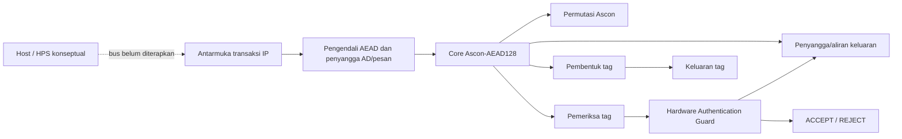

# SECURE-TINY

**Perancangan IP Core Authenticated Encryption Hemat Sumber Daya dengan Hardware Authentication Guard untuk Komunikasi Edge Aman**

SECURE-TINY adalah IP akselerator untuk enkripsi/dekripsi terautentikasi berbasis **Ascon-AEAD128** sesuai NIST SP 800-232 final. Tantangan utama proyek adalah **Hardware Cryptography Accelerator**, dengan **Secure Communication** sebagai tantangan pendukung dan **DE10-Nano FPGA/SoC** sebagai target evaluasi.

Repositori proyek: [github.com/Ripanrz/secure-tiny](https://github.com/Ripanrz/secure-tiny).

Proyek memusatkan pekerjaan pada jalur data RTL dan bukti fungsional. Klaim efisiensi belum dibuat karena penggunaan sumber daya dan timing FPGA belum diukur. Status pengujian dan batas hasil terbaru tercantum di [`docs/results.md`](docs/results.md); ruang lingkup dan persyaratan proyek tercantum di [`docs/PRD.md`](docs/PRD.md).

**Status kerja:** atas arahan pemilik proyek, tahap Quartus dan pengembangan/pengujian pada DE10-Nano ditahan sementara. Verifikasi lokal RTL, dokumentasi, dan persiapan proposal diteruskan. Penahanan ini tidak mengubah requirement target FPGA di PRD dan tidak berarti build FPGA telah lulus.

Draf proposal teknis tersedia di [`docs/proposal-draft.md`](docs/proposal-draft.md). Peta fungsi file dan komunikasi antarmodul tersedia di [`docs/file-map-and-integration.md`](docs/file-map-and-integration.md). Hasil Quartus yang belum tersedia ditandai TBD.

Draf proposal disusun mengikuti lima bagian yang diminta kompetisi: ringkasan ide, latar belakang dan rumusan masalah, rancangan chip, referensi, serta lampiran. Identitas tim dan pembagian peran masih berupa isian karena datanya belum diberikan.

## Latar belakang dan ruang lingkup

Perangkat edge dan IoT perlu melindungi kerahasiaan data sekaligus mendeteksi perubahan pada pesan dan metadata terkait. SECURE-TINY menguji fungsi itu sebagai IP enkripsi terautentikasi berbasis Ascon-AEAD128. Tantangan utamanya **Hardware Cryptography Accelerator**; **Secure Communication** menjadi fokus pendukung. Proyek ini belum mencakup elemen keamanan lengkap, protokol jaringan, pertukaran kunci, bus HPS/Avalon, atau sensor gangguan fisik.

PRD mengacu pada NIST SP 800-232 final. Ascon-AEAD128 adalah algoritma standar yang digunakan. Proyek tidak mengklaim novelty yang telah terbukti: integrasi IP modular dan penjagaan keluaran dekripsi adalah fokus implementasi yang perlu dibandingkan dengan prior-art dan diukur pada target FPGA.

### Dasar keamanan rancangan

Keamanan diperlakukan sebagai batas arsitektur: plaintext dekripsi tidak boleh keluar sebelum tag cocok, dan transaksi yang ditolak tidak boleh menghasilkan transfer plaintext. Key, state internal, dan calon plaintext adalah aset yang harus dipertimbangkan. Saat ini nonce dikelola pemanggil, sementara pembersihan semua salinan rahasia, mitigasi side-channel, fault injection, dan tampering fisik belum diterapkan atau dibuktikan. Perilaku penahanan plaintext telah diuji pada skenario simulasi yang tercatat; cakupan dan batas klaim dijelaskan di [`docs/PRD.md`](docs/PRD.md), [`docs/verification.md`](docs/verification.md), dan [`docs/results.md`](docs/results.md).

## Fitur dan status saat ini

- Permutasi Ascon iteratif: satu ronde per siklus aktif.
- Enkripsi dan dekripsi Ascon-AEAD128 dalam core dengan penyangga.
- Masukan AD dan pesan selebar satu byte dengan handshake `valid/ready`.
- Pembentuk tag, pembanding tag 128-bit, dan Hardware Authentication Guard.
- Plaintext dekripsi baru tersedia sesudah tag terverifikasi; tag/ciphertext salah ditolak tanpa mengeluarkan plaintext.
- Testbench core membandingkan RTL dengan 1.089 rekaman KAT Ascon-C v1.3.0 untuk enkripsi dan dekripsi (2.178 transaksi; kapasitas testbench 32 byte).
- Testbench tingkat atas menggunakan kapasitas 16 byte sesuai profil proyek Quartus; 289 pasangan panjang AD/pesan diuji untuk enkripsi dan dekripsi (578 transaksi).
- Pengendali menampung seluruh AD dan pesan sebelum memulai core; rancangan ini bukan akselerator aliran data kontinu.

> KAT Ascon-C dipakai sebagai uji tambahan. Acuan algoritma proyek adalah NIST SP 800-232 final. Pemeriksa Python juga membandingkan model dengan 14 kasus berukuran kelipatan byte dari sampel ACVP NIST; hasil Python tersebut bukan pengganti uji RTL.

## Arsitektur sistem



RTL tingkat atas saat ini memiliki antarmuka sinkron yang tidak bergantung pada board. `secure_tiny_top` menerima perintah, key/nonce, panjang AD/pesan, aliran AD/pesan, dan tag yang diterima untuk dekripsi. Transfer byte terjadi saat `valid && ready` pada tepi naik clock. `MAX_DATA_BYTES` membatasi panjang AD dan pesan secara terpisah. Build DE10-Nano menetapkan kapasitas 16 byte.

Saat enkripsi, core menghasilkan ciphertext dan tag. Saat dekripsi, calon plaintext tetap tertahan sampai tag cocok; jika tidak cocok, guard menolak dan tidak ada byte plaintext yang dinyatakan valid. Antarmuka HPS/Avalon, DMA, dan pemetaan pin untuk data transaksi belum dibuat. QSF menggunakan pin virtual untuk sinyal transaksi, sehingga preflight Quartus tidak berarti antarmuka sudah dapat diuji dari board.

### Modul RTL

| Modul | Fungsi |
|---|---|
| `ascon_permutation.sv` | Permutasi state 320-bit; menerima konfigurasi ronde dan memberikan status selesai/error. |
| `ascon_core.sv` | Mengolah inisialisasi, AD, pesan, finalisasi, data keluaran, dan tag. |
| `aead_controller.sv` | Mengatur satu transaksi, menerima aliran data ke penyangga, menjalankan core, serta mengatur verifikasi dan handshake keluaran. |
| `tag_generator.sv` | Menahan tag hasil sampai konsumen menerima tag. |
| `tag_verifier.sv` | Membandingkan seluruh 128 bit tag dan melaporkan match/mismatch. |
| `authentication_guard.sv` | Menyimpan keputusan autentikasi dan mengizinkan plaintext hanya jika dekripsi lolos verifikasi. |
| `secure_tiny_top.sv` | Menggabungkan modul menjadi satu IP dengan antarmuka sinkron. |
| `counter.sv` | Contoh pembelajaran pencacah; bukan bagian jalur data AEAD. |

## Perangkat pengembangan dan perangkat lunak

- **OSS CAD Suite for Windows**: paket perangkat lokal; skrip pengujian memakai `iverilog`, `vvp`, Yosys, dan Python dari paket tersebut.
- **Icarus Verilog**: kompilasi dan simulasi testbench SystemVerilog.
- **Verilator**: lint/elaborasi statis top-level RTL untuk pemeriksaan tambahan.
- **GTKWave**: melihat file waveform VCD.
- **Yosys**: sintesis generik RTL untuk pemeriksaan struktur.
- **Intel Quartus Prime Lite 25.1 untuk Windows**: pilihan awal yang disarankan untuk target proyek ini, bersama paket dukungan perangkat Cyclone V. Quartus Prime Lite mendukung Cyclone V dan tersedia tanpa biaya lisensi untuk alur yang dibutuhkan; pastikan pemilih perangkat memuat `5CSEBA6U23I7`. Quartus belum tersedia pada sesi verifikasi yang tercatat.
- **Python**: model referensi dan pemeriksa vektor.
- **VS Code**: editor yang dapat dipakai untuk melihat RTL, skrip, dan dokumen.
- **Git**: pengelolaan versi source dan dokumentasi.

Skrip pengujian memerlukan OSS CAD Suite. Atur `$env:OSS_CAD_SUITE` ke lokasi instalasi atau berikan parameter `-SuiteRoot`; kode sumber tidak menyimpan jalur khusus workstation tertentu.

## Penggunaan

### 1. Buka PowerShell di folder proyek

```powershell
Set-Location '<path-to-project>\secure-tiny'
$env:OSS_CAD_SUITE = 'C:\tools\oss-cad-suite'
```

Ganti jalur tersebut jika proyek atau OSS CAD Suite berada di lokasi lain.

### 2. Jalankan seluruh simulasi dan pembanding referensi

```powershell
powershell.exe -NoProfile -ExecutionPolicy Bypass -File .\scripts\run_all_tests.ps1
```

Rangkaian ini menjalankan counter, permutasi, KAT core RTL, uji unit tag/guard, uji terarah tingkat atas, sapuan KAT tingkat atas, pemeriksa Python ACVP, dan pemeriksa KAT Python. Kode keluar selain nol atau pesan `$fatal` berarti pengujian gagal. Icarus dapat menampilkan peringatan `constant selects in always_*`; catat peringatan tersebut dan jangan menafsirkannya sebagai hasil sintesis Quartus.

Runner individual tersedia di `scripts/run_counter.ps1`, `run_ascon_permutation.ps1`, `run_ascon_core.ps1`, `run_tag_auth_modules.ps1`, `run_secure_tiny_top.ps1`, `run_secure_tiny_kat.ps1`, dan `run_python_reference.ps1`.

### 3. Jalankan lint dan periksa sintesis/preflight FPGA

```powershell
powershell.exe -NoProfile -ExecutionPolicy Bypass -File .\scripts\lint_verilator.ps1 -MaxDataBytes 16
powershell.exe -NoProfile -ExecutionPolicy Bypass -File .\scripts\synth_yosys.ps1 -MaxDataBytes 16
powershell.exe -NoProfile -ExecutionPolicy Bypass -File .\scripts\check_quartus_project.ps1
```

Lint Verilator memeriksa elaborasi dan peringatan RTL, tetapi tidak membuktikan hasil Quartus atau perilaku kriptografi. Skrip memakai `bin\verilator_bin.exe` dari OSS CAD Suite dan mengatur `VERILATOR_ROOT` serta `PATH` secara lokal.

Sintesis generik menghasilkan log `sim/yosys_secure_tiny_16.log`. Angka 20.887 sel yang tercatat merupakan **sel generik Yosys**, bukan ALM/LE Cyclone V. Pemeriksaan awal hanya memeriksa konsistensi berkas dan penetapan statis.

Setelah Intel Quartus Prime yang mendukung Cyclone V dipasang dan `quartus_sh` tersedia di `PATH`, jalankan:

```powershell
powershell.exe -NoProfile -ExecutionPolicy Bypass -File .\scripts\build_quartus.ps1
```

Jika Quartus sudah terpasang tetapi belum ada di `PATH`, berikan path executable secara langsung:

```powershell
powershell.exe -NoProfile -ExecutionPolicy Bypass -File .\scripts\build_quartus.ps1 -QuartusSh 'C:\path\to\quartus_sh.exe'
```

Untuk menjalankan `quartus_map`, `quartus_fit`, `quartus_sta`, serta mengambil ALM/register/Fmax dari laporan `.rpt`:

```powershell
powershell.exe -NoProfile -ExecutionPolicy Bypass -File .\scripts\build_quartus_metrics.ps1
```

Jika perangkat Quartus tidak ada di `PATH`, berikan folder `bin64` melalui `-QuartusBin`. Log dan CSV metrik dibuat di folder `quartus/`; nilai yang tidak terdeteksi tetap ditandai `TBD`/`UNPARSED`. Skrip ini tidak membuat `.sof`; jalankan Assembler setelah proses fit berhasil.

Hanya laporan kompilasi Quartus yang sukses boleh dipakai untuk mengisi data resource, timing, dan pembuatan berkas pemrograman FPGA.

#### Panduan Quartus untuk tahap berikutnya (ditahan sementara)

Langkah di bawah disimpan sebagai panduan untuk nanti. Sesuai arahan pemilik proyek, instalasi, compile, analisis metrik, dan pengembangan DE10-Nano tidak dikerjakan pada tahap ini.

Gunakan [Quartus Prime Lite Edition 25.1 untuk Windows](https://www.altera.com/downloads/fpga-development-tools/quartus-prime-lite-edition-design-software-version-25-1-windows) dari situs Intel/Altera. Saat mengunduh atau memasang, pilih:

1. perangkat lunak Quartus Prime Lite;
2. dukungan perangkat **Cyclone V** (`cyclonev-25.1std.0.1129.qdz` pada paket 25.1).

Tidak perlu memilih dukungan keluarga FPGA lain untuk build RTL saat ini. Lite dipilih karena mendukung Cyclone V tanpa memerlukan lisensi berbayar untuk alur yang dibutuhkan proyek. Standard juga mendukung Cyclone V, tetapi tidak diperlukan sebagai pilihan awal. Jangan pilih Pro untuk proyek ini; tabel dukungan vendor tidak mencantumkan Cyclone V sebagai keluarga target Pro. [Matriks edisi dan perangkat Quartus](https://www.intel.com/content/www/us/en/products/details/fpga/development-tools/quartus-prime/resource.html) · [Paket dukungan Cyclone V 25.1](https://www.altera.com/downloads/fpga-development-tools/quartus-prime-lite-edition-design-software-version-25-1-windows).

Setelah pemasangan, temukan `quartus_sh.exe` dan folder `bin64` pada direktori instalasi. Jalankan dari PowerShell pada root proyek:

```powershell
powershell.exe -NoProfile -ExecutionPolicy Bypass -File .\scripts\check_quartus_project.ps1
powershell.exe -NoProfile -ExecutionPolicy Bypass -File .\scripts\build_quartus.ps1 -QuartusSh 'C:\path\to\quartus_sh.exe'
powershell.exe -NoProfile -ExecutionPolicy Bypass -File .\scripts\build_quartus_metrics.ps1 -QuartusBin 'C:\path\to\quartus\bin64'
```

`build_quartus.ps1` meminta alur compile penuh; `build_quartus_metrics.ps1` menjalankan map, fit, dan timing serta mengurai laporan yang dikenali skrip. Baca laporan Quartus asli dan pastikan Assembler menghasilkan `.sof`. Skrip ekstraksi metrik tidak menggantikan pemeriksaan laporan dan tidak membuat `.sof` sendiri. Pemasangan Quartus juga tidak menambahkan jalur transaksi host ke desain: port transaksi masih berupa virtual pins.

### 4. Buka waveform dengan GTKWave

Testbench menghasilkan VCD di `sim/`. Untuk top-level:

```powershell
& "$env:OSS_CAD_SUITE\bin\gtkwave.exe" .\sim\secure_tiny_top.vcd
```

Berkas waveform lainnya: `counter.vcd`, `ascon_permutation.vcd`, `ascon_core.vcd`, `tag_auth_modules.vcd`, dan `secure_tiny_kat.vcd`. Jika program GTKWave memiliki nama atau lokasi berbeda pada paket Anda, buka berkas VCD melalui menu **File → Open**.

## Hasil verifikasi yang tercatat

Hasil pengujian lokal 1 Oktober 2026 menunjukkan seluruh skrip pengujian berstatus PASS. Core RTL cocok dengan seluruh 1.089 rekaman Ascon-C KAT pada kedua mode (2.178 transaksi; total 121.308 siklus; maksimum 88). Modul tingkat atas juga cocok dengan 289 pasangan panjang AD/pesan hingga 16 byte untuk enkripsi dan dekripsi (578 transaksi; maksimum 150 siklus termasuk waktu masukan). Model Python cocok dengan 14 sampel ACVP berukuran kelipatan byte dan seluruh KAT. Rincian versi alat, sumber vektor, hash, batas klaim, dan hasil tiap skenario tersedia di [`docs/results.md`](docs/results.md).

Pada 1 Oktober 2026, lint Verilator 5.053 untuk tingkat atas dengan `MAX_DATA_BYTES=16` juga lulus tanpa peringatan; ini pemeriksaan elaborasi/lint, bukan kompilasi Quartus.

**Belum diukur/dibuat:** penggunaan resource Cyclone V, Fmax/timing FPGA, berkas `.sof`, throughput pada perangkat keras, dan pengujian DE10-Nano. Antarmuka transaksi host juga belum terintegrasi. Belum ada klaim pengujian board atau fabrikasi ASIC.

## Peta repositori

```text
SECURE-TINY/
├── docs/       PRD, arsitektur, spesifikasi modul, verifikasi, hasil, proposal
├── quartus/    QPF/QSF/SDC untuk target Cyclone V DE10-Nano
├── rtl/        RTL SystemVerilog yang dapat disintesis
├── scripts/    skrip simulasi/lint, sintesis Yosys, pemeriksaan awal dan build Quartus
├── sim/        VCD dan log hasil alat; file .vvp sementara dapat dibuat ulang
├── tb/         rangkaian uji counter, permutasi, core, tag/guard, dan modul tingkat atas
├── python/     model Ascon dan pembanding vektor
└── vectors/    sampel ACVP NIST dan KAT tambahan Ascon-C
```

`docs/PRD.md` adalah satu-satunya PRD dan sumber persyaratan produk. Dokumen arsitektur, spesifikasi modul, verifikasi, hasil, dan peta file tersedia di `docs/`.

## Rencana pengembangan

Urutan kerja yang disarankan agar hasil tidak tercampur:

1. **Bekukan baseline RTL:** simpan commit/versi, parameter 16 byte, hasil regresi, dan konfigurasi QSF/SDC saat ini.
2. **Bangun baseline Quartus:** catat versi Quartus, perangkat, peringatan, ALM/register/memori, Fmax/slack, serta hasil `.sof` jika compile penuh berhasil. Jangan memakai sel generik Yosys sebagai resource Cyclone V.
3. **Pilih satu hipotesis optimasi:** misalnya pengurangan buffer atau perubahan jadwal permutasi. Tentukan metrik yang akan membuktikan manfaatnya sebelum mengubah RTL.
4. **Ubah secara bertahap:** jelaskan dampak antarmuka dan keamanan; jalankan regresi KAT, kasus tepi, lint, lalu Quartus lagi.
5. **Pertimbangkan arsitektur aliran data setelah baseline.** Dekripsi tetap harus menahan calon plaintext sampai tag valid; aliran langsung ke konsumen tidak boleh membuka plaintext sebelum autentikasi.
6. **Uji board hanya setelah interface fisik/host tersedia.** `.sof` dan compile Quartus saja bukan bukti transaksi bekerja di DE10-Nano.

Glosarium singkat: **clock** mengatur kapan nilai register berubah; **FSM** adalah urutan keadaan kendali; **valid/ready** berarti transfer terjadi saat keduanya aktif pada tepi clock; **simulasi** memeriksa perilaku model RTL; **sintesis** mengubah RTL menjadi logika; **Fitter** memetakan logika ke FPGA; **timing** memeriksa apakah jalur logika selesai dalam batas periode clock; **PPA** berarti daya, performa, dan area/resource. Lihat [`docs/architecture.md`](docs/architecture.md) untuk trade-off arsitektur dan [`docs/verification.md`](docs/verification.md) untuk gerbang verifikasi.

## Lisensi dan atribusi

Kode sumber dan dokumentasi SECURE-TINY dilisensikan berdasarkan [Lisensi MIT](LICENSE). Vektor uji pihak ketiga disertakan agar hasil dapat direproduksi dan tetap tunduk pada ketentuan sumber masing-masing. KAT Ascon-C v1.3.0 berasal dari repositori hulu berlisensi CC0-1.0 ([lisensi hulu](https://github.com/ascon/ascon-c/blob/v1.3.0/LICENSE)); lisensi proyek tidak mengubah lisensi atau atribusi materi pihak ketiga. Sumber dan identitas vektor dicatat di [`docs/verification.md`](docs/verification.md) dan [`docs/results.md`](docs/results.md).

## Rujukan utama

1. NIST, [SP 800-232 final: Standar Kriptografi Ringan Berbasis Ascon untuk Perangkat Terbatas](https://csrc.nist.gov/pubs/sp/800/232/final), 2025.
2. NIST, [Publikasi Kriptografi Ringan dan informasi standardisasi](https://csrc.nist.gov/Projects/lightweight-cryptography/publications).
3. NIST ACVP Server, [vektor sampel Ascon-AEAD128 SP 800-232](https://github.com/usnistgov/ACVP-Server/tree/master/gen-val/json-files/Ascon-AEAD128-SP800-232).
4. Tim Ascon, [kode sumber ascon-c dan riwayat rilis](https://github.com/ascon/ascon-c), termasuk KAT tambahan yang versinya dicatat di `docs/results.md`.
5. Terasic, [halaman produk DE10-Nano dan panduan pengguna](https://www.terasic.com.tw/cgi-bin/page/archive.pl?CategoryNo=204&Language=English&No=1046&PartNo=4).
6. Intel, [Panduan Pengguna Quartus Prime: Memulai](https://www.intel.com/content/www/us/en/docs/programmable/683475.html).

Tanggal akses rujukan daring: 1 Oktober 2026.
