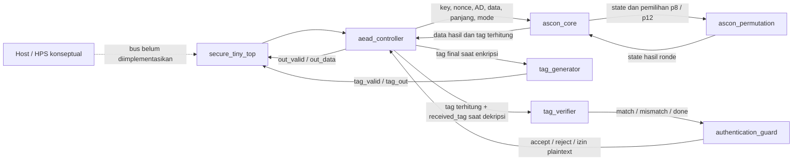

# Peta File dan Integrasi SECURE-TINY

Panduan ini menjelaskan struktur sumber proyek, peran file teknis, dan jalur komunikasi antarmodul.

## 1. Gambaran integrasi

SECURE-TINY adalah IP accelerator Ascon-AEAD128. Satu transaksi dimulai lewat command, kemudian AD dan pesan dikirim byte per byte menggunakan handshake `valid/ready`. Controller menampung seluruh input, menjalankan core kriptografi, lalu mengeluarkan ciphertext dan tag untuk enkripsi. Untuk dekripsi, plaintext baru ditawarkan setelah tag lolos verifikasi.



Host/HPS pada diagram hanya konteks integrasi. Tidak ada AXI, Avalon, DMA, parser paket, atau wrapper HPS pada RTL saat ini. Di file Quartus, port transaksi dibuat sebagai virtual pins; hanya clock dan reset yang memiliki pin board yang ditetapkan.

### Jalur command dan data

| Arah | Sinyal | Fungsi |
|---|---|---|
| Pemanggil → top | `start`, `decrypt`, `key`, `nonce`, `ad_length`, `data_length`, `received_tag` | Memulai satu transaksi dan membawa konfigurasi. `received_tag` digunakan pada dekripsi. Command hanya diterima saat `busy=0`. |
| Pengirim AD → top/controller | `ad_valid`, `ad_ready`, `ad_data[7:0]` | Mengirim tepat `ad_length` byte sebelum pesan. Transfer terjadi pada tepi naik clock saat `ad_valid && ad_ready`. |
| Pengirim pesan → top/controller | `data_valid`, `data_ready`, `data_in[7:0]` | Mengirim plaintext untuk enkripsi atau ciphertext untuk dekripsi. Transfer juga terjadi pada `valid && ready`. |
| Top/controller → penerima hasil | `out_valid`, `out_ready`, `out_data[7:0]` | Mengirim ciphertext pada enkripsi atau plaintext terautentikasi pada dekripsi. Penerima mengambil byte hanya saat `out_valid && out_ready`. |
| Top/controller → penerima tag | `tag_valid`, `tag_ready`, `tag_out[127:0]` | Mengirim tag hasil enkripsi. Controller menunggu handshake tag sebelum menyelesaikan transaksi. |
| Top/controller → pemanggil | `busy`, `done`, `command_error`, `auth_result_valid`, `accept`, `reject` | Status operasi. `command_error` menandai panjang melebihi kapasitas; `accept/reject` adalah hasil autentikasi dekripsi. |

`MAX_DATA_BYTES` membatasi panjang AD dan pesan secara terpisah. Proyek Quartus memakai 16 byte untuk masing-masing. `rst_n` adalah reset sinkron aktif-rendah. Reset membatalkan transaksi aktif.

### Urutan internal transaksi

1. Pemanggil mengaktifkan `start` dan mempertahankan nilai command pada tepi sampling. Controller menyimpan mode, key, nonce, panjang, dan tag masuk.
2. Controller menerima seluruh AD, kemudian seluruh pesan/ciphertext. Byte pertama menempati lane `[7:0]` buffer packed.
3. Setelah input lengkap, controller memberi pulsa `core_start` kepada core.
4. Core menginisialisasi state, menyerap AD, memproses pesan, dan melakukan finalisasi. Core meminta permutasi p12/p8 ke `ascon_permutation`; permutasi mengerjakan satu ronde per siklus aktif dan mengembalikan state setelah ronde selesai.
5. Pada enkripsi, core memberikan data ciphertext dan tag. Controller menyalurkan ciphertext lebih dahulu. Setelah byte ciphertext terakhir diterima (atau setelah core selesai untuk pesan kosong), `tag_generator` menyajikan tag hingga `tag_ready`.
6. Pada dekripsi, core memberikan calon plaintext dan tag terhitung. `tag_verifier` membandingkan semua 128 bit tag terhitung dengan tag masukan. Guard menerbitkan ACCEPT jika cocok; controller baru membuka stream plaintext setelah keputusan itu. Jika tidak cocok, controller menerbitkan REJECT tanpa mengeluarkan plaintext.
7. `done` memberi tanda transaksi selesai. Perintah dengan AD atau data di atas kapasitas ditolak dengan pulsa `command_error` dan `done`, tanpa menerima stream data.

## 2. File tingkat root

| File | Fungsi |
|---|---|
| `.gitignore` | Mengecualikan cache, artefak simulasi/build, file credential, dan konfigurasi lokal dari Git. |
| `README.md` | Pengenalan proyek, status, arsitektur ringkas, toolchain, perintah simulasi/sintesis, dan peta repositori. |
| `Makefile` | Alias command untuk beberapa test dan langkah Yosys/Quartus. Target `make test` belum mencakup seluruh tujuh runner; gunakan `scripts/run_all_tests.ps1` untuk regression lengkap. |

## 3. Dokumentasi (`docs/`)

| File | Fungsi |
|---|---|
| `docs/PRD.md` | Satu-satunya PRD dan sumber requirement produk, termasuk scope, kontrak transaksi, target DE10-Nano, metrik, dan definisi selesai. |
| `docs/architecture.md` | Arsitektur yang direalisasikan, urutan transaksi, perilaku autentikasi, reset, batas kapasitas, dan keterbatasan integrasi host. |
| `docs/module_spec.md` | Kontrak port dan perilaku tiap modul RTL, termasuk handshake, urutan byte, status, dan kondisi error. |
| `docs/verification.md` | Rencana dan cakupan verifikasi, sumber vector, serta batas klaim pengujian. |
| `docs/results.md` | Hasil run yang diamati, versi/perintah tool, latensi simulasi, identitas vector, dan status Quartus/hardware. |
| `docs/proposal-draft.md` | Draf proposal kompetisi. Hasil terukur dipisahkan dari target dan pekerjaan yang belum dilakukan. |
| `docs/file-map-and-integration.md` | Dokumen ini: katalog file serta diagram/alur komunikasi RTL. |

## 4. RTL (`rtl/`)

| File | Fungsi dan koneksi |
|---|---|
| `rtl/secure_tiny_top.sv` | Top-level IP. Meneruskan command, stream AD/pesan, stream hasil/tag, dan status ke/dari `aead_controller`. Parameter `MAX_DATA_BYTES` wajib diberikan. |
| `rtl/aead_controller.sv` | FSM dan buffer transaksi. Menerima AD/pesan, memulai core, menangani keluaran, mengatur tag generator/verifier/guard, dan menghasilkan `busy/done/error/status`. Instansiasi modul AEAD lain selain top-level. |
| `rtl/ascon_core.sv` | Datapath/control AEAD buffered: key/nonce initialization, absorpsi AD, pemrosesan pesan, finalisasi, keluaran data dan tag. Menggunakan `ascon_permutation`. |
| `rtl/ascon_permutation.sv` | Transformasi permutasi Ascon 320-bit iteratif. Menerima state dan jumlah ronde, menjalankan satu ronde per siklus aktif, lalu mengeluarkan state akhir serta `done`. Dipakai core untuk p8/p12. |
| `rtl/tag_generator.sv` | Register/handshake untuk menahan tag final dari core dan menyajikannya dengan `tag_valid/tag_ready`. Tidak menghitung tag kriptografi. |
| `rtl/tag_verifier.sv` | Membandingkan tag terhitung dan tag masuk sepanjang 128 bit, lalu memberi hasil match/mismatch kepada controller/guard. |
| `rtl/authentication_guard.sv` | Menyimpan/mengeluarkan keputusan autentikasi dan sinyal izin plaintext. Dipakai controller untuk mencegah plaintext keluar sebelum tag valid. |
| `rtl/counter.sv` | Counter latihan untuk reset, enable, hold, dan wrap. Bukan bagian dari datapath Ascon atau top-level Quartus. |

Semua jalur sekuensial memakai `clk` dan reset sinkron aktif-rendah `rst_n`. Controller membentuk subsistem produk; `counter` hanya untuk demonstrasi/test terpisah.

## 5. Testbench (`tb/`)

| File | DUT/cakupan |
|---|---|
| `tb/tb_counter.sv` | Menguji reset, enable, hold, dan wrap `counter`. |
| `tb/tb_ascon_permutation.sv` | Menguji hasil permutasi p8/p12 serta kontrol start/busy/done/error. |
| `tb/tb_ascon_core.sv` | Membaca seluruh 1.089 record KAT Ascon-C dan membandingkan enkripsi serta dekripsi pada core RTL (2.178 transaksi). |
| `tb/tb_tag_auth_modules.sv` | Menguji handshake tag generator, perbandingan tag verifier, keputusan guard, reset/clear dan backpressure. |
| `tb/tb_secure_tiny_top.sv` | Uji integrasi terarah: KAT, handshake/stall, accept/reject, tidak ada plaintext saat reject, start saat busy, reset di beberapa fase, dan panjang AD/data melebihi kapasitas. |
| `tb/tb_secure_tiny_kat.sv` | Sweep 289 pasangan panjang AD/pesan dari 0 sampai 16 byte untuk enkripsi dan dekripsi top-level (578 transaksi) terhadap KAT. Memeriksa juga urutan ciphertext/tag dan plaintext setelah autentikasi. |

## 6. Model dan vector (`python/`, `vectors/`)

| File | Fungsi |
|---|---|
| `python/ascon_aead128_reference.py` | Model referensi Python Ascon-AEAD128 untuk pemeriksaan diferensial. Ini alat uji, bukan RTL produksi. |
| `python/check_ascon_acvp_sample.py` | Membaca prompt/expected ACVP lokal dan membandingkan hasil model Python untuk sampel byte-aligned. |
| `python/check_ascon_c_kat.py` | Membandingkan model Python terhadap seluruh KAT Ascon-C v1.3.0 lokal. |
| `vectors/ascon_aead128_prompt.json` | Input prompt vector sampel NIST ACVP SP 800-232. |
| `vectors/ascon_aead128_expected.json` | Hasil yang diharapkan untuk prompt ACVP tersebut. Checker Python menggunakannya sebagai oracle vector. |
| `vectors/ascon_c_v1.3.0_ref/LWC_AEAD_KAT_128_128.txt` | KAT upstream Ascon-C yang dipakai testbench core dan checker Python sebagai pengujian tambahan. |

Testbench RTL menggunakan file KAT Ascon-C. Vector ACVP lokal saat ini diverifikasi oleh model Python; hasil Python bukan pengganti pembandingan RTL.

## 7. Skrip (`scripts/`)

| File | Fungsi |
|---|---|
| `scripts/run_iverilog.ps1` | Runner umum: memetakan OSS CAD Suite ke drive sementara pada Windows, mengompilasi source dengan Icarus, menjalankan VVP, lalu memulihkan environment/drive. |
| `scripts/run_counter.ps1` | Memilih RTL/testbench counter dan memanggil runner Icarus umum. |
| `scripts/run_ascon_permutation.ps1` | Menjalankan testbench permutasi. |
| `scripts/run_ascon_core.ps1` | Menjalankan KAT core RTL. Sweep KAT top-level dijalankan oleh `scripts/run_secure_tiny_kat.ps1`. |
| `scripts/run_tag_auth_modules.ps1` | Menjalankan uji unit tag generator/verifier/guard. |
| `scripts/run_secure_tiny_top.ps1` | Menjalankan directed integration test top-level. |
| `scripts/run_secure_tiny_kat.ps1` | Menjalankan length-pair KAT sweep top-level. |
| `scripts/run_python_reference.ps1` | Menjalankan dua checker Python dengan interpreter dari OSS CAD Suite. |
| `scripts/run_all_tests.ps1` | Menjalankan tujuh runner verifikasi satu per satu dan gagal jika ada runner gagal. Ini entry point regression lengkap. |
| `scripts/lint_verilator.ps1` | Mengatur environment OSS CAD Suite dan menjalankan `verilator_bin.exe --lint-only` pada top-level dengan kapasitas pilihan. |
| `scripts/synth_yosys.ps1` | Menjalankan sintesis generik Yosys untuk `secure_tiny_top` pada kapasitas yang dipilih dan mencatat log di `sim/`. Angka sel generik bukan laporan ALM Quartus. |
| `scripts/check_quartus_project.ps1` | Preflight statis QPF/QSF/SDC, daftar RTL, device, parameter, pin clock/reset, virtual pins, dan constraint clock. Tidak menjalankan compiler Quartus. |
| `scripts/build_quartus.ps1` | Menjalankan preflight lalu `quartus_sh --flow compile secure_tiny`; menerima executable melalui `-QuartusSh` atau mencari nama command di `PATH`. |
| `scripts/build_quartus_metrics.ps1` | Menjalankan preflight, `quartus_map`, `quartus_fit`, dan `quartus_sta`; mengekstrak ALM/register/Fmax dari report jika format dikenali dan menulis CSV dengan baris bukti. Memerlukan Quartus; tidak menjalankan Assembler. |

## 8. Proyek FPGA (`quartus/`)

| File | Fungsi |
|---|---|
| `quartus/secure_tiny.qpf` | File proyek Quartus yang memilih revision `secure_tiny`. |
| `quartus/secure_tiny.qsf` | Menentukan Cyclone V `5CSEBA6U23I7`, top-level, source RTL, kapasitas 16 byte, pin clock/reset, dan virtual pins untuk port transaksi IP. |
| `quartus/secure_tiny.sdc` | Constraint clock `FPGA_CLK1_50` sebesar 20 ns (50 MHz) dan clock uncertainty. Ini constraint target, bukan bukti timing tercapai. |

## 9. Hasil simulasi dan log (`sim/`)

| File | Fungsi |
|---|---|
| `sim/counter.vcd` | Waveform testbench counter. |
| `sim/ascon_permutation.vcd` | Waveform testbench permutasi. |
| `sim/ascon_core.vcd` | Waveform contoh testbench core; ringkasan semua vector ada di output/log regression. |
| `sim/tag_auth_modules.vcd` | Waveform tag generator, verifier, dan guard. |
| `sim/secure_tiny_top.vcd` | Waveform directed integration top-level. |
| `sim/secure_tiny_kat.vcd` | Waveform contoh sweep KAT top-level; file berisi transaksi awal agar ukurannya terkendali. |
| `sim/verilator_secure_tiny_16.log` | Output lint/elaborasi Verilator top-level untuk parameter 16 byte. |
| `sim/yosys_secure_tiny_16.log` | Log sintesis generik Yosys untuk parameter 16. |
| `sim/yosys_cyclonev_16.log` | Log percobaan mapping Cyclone V Yosys. Percobaan berhenti pada assertion internal ABC9 dan tidak memberi angka resource Cyclone V yang valid. |

File `.vvp`, VCD, dan log adalah output runner yang dapat dibuat ulang. `.gitignore` mengecualikannya dari repository; jalankan test, lint, atau sintesis untuk membuat artefak lokal tersebut.

## 10. Alur command utama

```text
run_all_tests.ps1
  ├─ counter / permutation / core RTL KAT
  ├─ tag-generator + verifier + guard
  ├─ directed top-level
  ├─ top-level KAT length-pair sweep
  └─ Python model vs ACVP + Ascon-C KAT

lint_verilator.ps1 ─────────> elaborasi/lint RTL top-level
check_quartus_project.ps1 ──> cek file/assignment statis saja
build_quartus.ps1 ──────────> preflight ──> quartus_sh compile (Quartus diperlukan)
synth_yosys.ps1 ────────────> sintesis generik dan log (bukan Quartus)
```

Untuk detail port/status dan hasil terukur, lihat [`module_spec.md`](module_spec.md), [`verification.md`](verification.md), dan [`results.md`](results.md). Status saat dokumen ini dibuat: regression RTL sebelumnya lulus; preflight Quartus lulus; compile Quartus, resource/timing FPGA, bitstream, dan uji papan belum terverifikasi.
