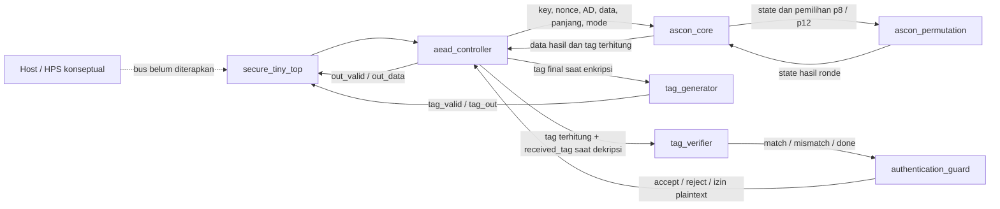

# Peta File dan Integrasi SECURE-TINY

Panduan ini menjelaskan struktur sumber proyek, peran file teknis, dan jalur komunikasi antarmodul.

## 1. Gambaran integrasi

SECURE-TINY adalah IP akselerator Ascon-AEAD128. Satu transaksi dimulai dengan perintah, kemudian AD dan pesan dikirim per byte menggunakan handshake `valid/ready`. Pengendali menampung seluruh masukan, menjalankan core kriptografi, lalu mengeluarkan ciphertext dan tag untuk enkripsi. Untuk dekripsi, plaintext baru ditawarkan setelah tag lolos verifikasi.



Host/HPS pada diagram hanya konteks integrasi. Tidak ada AXI, Avalon, DMA, parser paket, atau wrapper HPS pada RTL saat ini. Di file Quartus, port transaksi dibuat sebagai virtual pins; hanya clock dan reset yang memiliki pin board yang ditetapkan.

### Jalur perintah dan data

| Arah | Sinyal | Fungsi |
|---|---|---|
| Pemanggil → modul tingkat atas | `start`, `decrypt`, `key`, `nonce`, `ad_length`, `data_length`, `received_tag` | Memulai satu transaksi dan membawa konfigurasinya. `received_tag` digunakan pada dekripsi. Perintah hanya diterima saat `busy=0`. |
| Pengirim AD → tingkat atas/pengendali | `ad_valid`, `ad_ready`, `ad_data[7:0]` | Mengirim tepat `ad_length` byte sebelum pesan. Transfer terjadi pada tepi naik clock saat `ad_valid && ad_ready`. |
| Pengirim pesan → tingkat atas/pengendali | `data_valid`, `data_ready`, `data_in[7:0]` | Mengirim plaintext untuk enkripsi atau ciphertext untuk dekripsi. Transfer juga terjadi saat `valid && ready`. |
| Tingkat atas/pengendali → penerima hasil | `out_valid`, `out_ready`, `out_data[7:0]` | Mengirim ciphertext pada enkripsi atau plaintext terautentikasi pada dekripsi. Penerima mengambil byte hanya saat `out_valid && out_ready`. |
| Tingkat atas/pengendali → penerima tag | `tag_valid`, `tag_ready`, `tag_out[127:0]` | Mengirim tag hasil enkripsi. Pengendali menunggu handshake tag sebelum menyelesaikan transaksi. |
| Tingkat atas/pengendali → pemanggil | `busy`, `done`, `command_error`, `auth_result_valid`, `accept`, `reject` | Status operasi. `command_error` menandai panjang yang melebihi kapasitas; `accept/reject` adalah hasil autentikasi dekripsi. |

`MAX_DATA_BYTES` membatasi panjang AD dan pesan secara terpisah. Proyek Quartus memakai 16 byte untuk masing-masing. `rst_n` adalah reset sinkron aktif-rendah. Reset membatalkan transaksi aktif.

### Urutan internal transaksi

1. Pemanggil mengaktifkan `start` dan mempertahankan nilai perintah hingga tepi sampling. Pengendali menyimpan mode, key, nonce, panjang, dan tag masukan.
2. Pengendali menerima seluruh AD, kemudian seluruh pesan/ciphertext. Byte pertama menempati lane `[7:0]` penyangga packed.
3. Setelah seluruh masukan diterima, pengendali memberi pulsa `core_start` kepada core.
4. Core menginisialisasi state, menyerap AD, memproses pesan, dan melakukan finalisasi. Core meminta permutasi p12/p8 ke `ascon_permutation`; permutasi mengerjakan satu ronde per siklus aktif dan mengembalikan state setelah ronde selesai.
5. Pada enkripsi, core memberikan data ciphertext dan tag. Controller menyalurkan ciphertext lebih dahulu. Setelah byte ciphertext terakhir diterima (atau setelah core selesai untuk pesan kosong), `tag_generator` menyajikan tag hingga `tag_ready`.
6. Pada dekripsi, core memberikan calon plaintext dan tag terhitung. `tag_verifier` membandingkan seluruh 128 bit tag terhitung dengan tag masukan. Guard menerbitkan ACCEPT jika cocok; pengendali baru membuka aliran plaintext setelah keputusan itu. Jika tidak cocok, pengendali menerbitkan REJECT tanpa mengeluarkan plaintext.
7. `done` menandai transaksi selesai. Perintah dengan AD atau data melebihi kapasitas ditolak dengan pulsa `command_error` dan `done`, tanpa menerima aliran data.

## 2. File tingkat root

| File | Fungsi |
|---|---|
| `.gitignore` | Mengecualikan cache, artefak simulasi/build, file credential, dan konfigurasi lokal dari Git. |
| `README.md` | Pengenalan proyek, status, arsitektur ringkas, perangkat pengembangan, perintah simulasi/sintesis, dan peta repositori. |
| `Makefile` | Alias perintah untuk regresi lengkap, pengujian individual, lint, sintesis Yosys, dan alur Quartus. Target `make test` memanggil `scripts/run_all_tests.ps1`. |

## 3. Dokumentasi (`docs/`)

| File | Fungsi |
|---|---|
| `docs/PRD.md` | Satu-satunya dokumen persyaratan produk dan sumber ketentuan produk, termasuk ruang lingkup, kontrak transaksi, target DE10-Nano, metrik, dan definisi selesai. |
| `docs/architecture.md` | Arsitektur yang diterapkan, urutan transaksi, perilaku autentikasi, reset, batas kapasitas, dan keterbatasan integrasi host. |
| `docs/module_spec.md` | Kontrak port dan perilaku tiap modul RTL, termasuk handshake, urutan byte, status, dan kondisi kesalahan. |
| `docs/verification.md` | Rencana dan cakupan verifikasi, sumber vektor, serta batas klaim pengujian. |
| `docs/results.md` | Hasil pengujian yang diamati, versi/perintah alat, latensi simulasi, identitas vektor, dan status Quartus/perangkat keras. |
| `docs/proposal-draft.md` | Draf proposal kompetisi. Hasil terukur dipisahkan dari target dan pekerjaan yang belum dilakukan. |
| `docs/file-map-and-integration.md` | Dokumen ini: katalog file serta diagram/alur komunikasi RTL. |

## 4. RTL (`rtl/`)

| File | Fungsi dan koneksi |
|---|---|
| `rtl/secure_tiny_top.sv` | Modul IP tingkat atas. Meneruskan perintah, aliran AD/pesan, aliran hasil/tag, dan status ke/dari `aead_controller`. Parameter `MAX_DATA_BYTES` wajib diberikan. |
| `rtl/aead_controller.sv` | FSM dan penyangga transaksi. Menerima AD/pesan, memulai core, menangani keluaran, mengatur pembentuk/pemeriksa tag dan guard, lalu menghasilkan `busy/done/error/status`. Modul ini menginstansiasi seluruh modul AEAD selain tingkat atas. |
| `rtl/ascon_core.sv` | Jalur data/kendali AEAD dengan penyangga: inisialisasi key/nonce, absorpsi AD, pemrosesan pesan, finalisasi, serta keluaran data dan tag. Menggunakan `ascon_permutation`. |
| `rtl/ascon_permutation.sv` | Transformasi permutasi Ascon 320-bit iteratif. Menerima state dan jumlah ronde, menjalankan satu ronde per siklus aktif, lalu mengeluarkan state akhir serta `done`. Dipakai core untuk p8/p12. |
| `rtl/tag_generator.sv` | Register/handshake untuk menahan tag final dari core dan menyajikannya dengan `tag_valid/tag_ready`. Tidak menghitung tag kriptografi. |
| `rtl/tag_verifier.sv` | Membandingkan tag terhitung dengan tag masukan sepanjang 128 bit, lalu memberi hasil cocok/tidak cocok kepada pengendali/guard. |
| `rtl/authentication_guard.sv` | Menyimpan/mengeluarkan keputusan autentikasi dan sinyal izin plaintext. Dipakai pengendali untuk mencegah plaintext keluar sebelum tag dinyatakan valid. |
| `rtl/counter.sv` | Pencacah latihan untuk reset, aktifkan, tahan, dan limpahan. Bukan bagian dari jalur data Ascon atau modul tingkat atas Quartus. |

Semua jalur sekuensial memakai `clk` dan reset sinkron aktif-rendah `rst_n`. Controller membentuk subsistem produk; `counter` hanya untuk demonstrasi/test terpisah.

## 5. Rangkaian Uji (`tb/`)

| Berkas | Modul yang diuji/cakupan |
|---|---|
| `tb/tb_counter.sv` | Menguji reset, aktifkan, tahan, dan limpahan `counter`. |
| `tb/tb_ascon_permutation.sv` | Menguji hasil permutasi p8/p12 serta kendali start/busy/done/error. |
| `tb/tb_ascon_core.sv` | Membaca seluruh 1.089 rekaman KAT Ascon-C dan membandingkan enkripsi serta dekripsi pada core RTL (2.178 transaksi). |
| `tb/tb_tag_auth_modules.sv` | Menguji handshake pembentuk tag, perbandingan pemeriksa tag, keputusan guard, reset/pembersihan, dan penahanan keluaran. |
| `tb/tb_secure_tiny_top.sv` | Uji integrasi terarah: KAT, handshake/jeda, terima/tolak, perubahan AD/tag/ciphertext tanpa plaintext, start saat sibuk, reset pada beberapa fase, serta panjang AD/data yang melebihi kapasitas. |
| `tb/tb_secure_tiny_kat.sv` | Sapuan 289 pasangan panjang AD/pesan dari 0 sampai 16 byte untuk enkripsi dan dekripsi pada modul tingkat atas (578 transaksi) terhadap KAT. Turut memeriksa urutan ciphertext/tag dan plaintext setelah autentikasi. |

## 6. Model dan vektor (`python/`, `vectors/`)

| File | Fungsi |
|---|---|
| `python/ascon_aead128_reference.py` | Model referensi Python Ascon-AEAD128 untuk pemeriksaan diferensial. Ini alat uji, bukan RTL produksi. |
| `python/check_ascon_acvp_sample.py` | Membaca prompt dan hasil harapan ACVP lokal, lalu membandingkan hasil model Python untuk sampel berukuran kelipatan byte. |
| `python/check_ascon_c_kat.py` | Membandingkan model Python terhadap seluruh KAT Ascon-C v1.3.0 lokal. |
| `vectors/ascon_aead128_prompt.json` | Masukan prompt vektor sampel NIST ACVP SP 800-232. |
| `vectors/ascon_aead128_expected.json` | Hasil yang diharapkan untuk prompt ACVP tersebut. Pemeriksa Python menggunakannya sebagai pembanding vektor. |
| `vectors/ascon_c_v1.3.0_ref/LWC_AEAD_KAT_128_128.txt` | KAT dari repositori hulu Ascon-C yang digunakan testbench core dan pemeriksa Python sebagai pengujian tambahan. |

Rangkaian uji RTL menggunakan berkas KAT Ascon-C. Vektor ACVP lokal saat ini diperiksa oleh model Python; hasil Python bukan pengganti pembandingan RTL.

## 7. Skrip (`scripts/`)

| File | Fungsi |
|---|---|
| `scripts/run_iverilog.ps1` | Skrip umum: memetakan OSS CAD Suite ke drive sementara pada Windows, mengompilasi kode sumber dengan Icarus, menjalankan VVP, lalu memulihkan lingkungan/drive. |
| `scripts/run_counter.ps1` | Memilih RTL/testbench counter dan memanggil skrip Icarus umum. |
| `scripts/run_ascon_permutation.ps1` | Menjalankan testbench permutasi. |
| `scripts/run_ascon_core.ps1` | Menjalankan KAT core RTL. Sapuan KAT tingkat atas dijalankan oleh `scripts/run_secure_tiny_kat.ps1`. |
| `scripts/run_tag_auth_modules.ps1` | Menjalankan uji unit tag generator/verifier/guard. |
| `scripts/run_secure_tiny_top.ps1` | Menjalankan pengujian integrasi terarah pada modul tingkat atas. |
| `scripts/run_secure_tiny_kat.ps1` | Menjalankan sapuan KAT pasangan panjang pada modul tingkat atas. |
| `scripts/run_python_reference.ps1` | Menjalankan dua pemeriksa Python dengan interpreter dari OSS CAD Suite. |
| `scripts/run_all_tests.ps1` | Menjalankan tujuh skrip verifikasi secara berurutan dan melaporkan kegagalan jika ada skrip yang gagal. Ini adalah titik masuk regresi lengkap. |
| `scripts/lint_verilator.ps1` | Mengatur lingkungan OSS CAD Suite dan menjalankan `verilator_bin.exe --lint-only` pada modul tingkat atas dengan kapasitas pilihan. |
| `scripts/synth_yosys.ps1` | Menjalankan sintesis generik Yosys untuk `secure_tiny_top` pada kapasitas yang dipilih dan mencatat log di `sim/`. Jumlah sel generik bukan laporan ALM Quartus. |
| `scripts/check_quartus_project.ps1` | Pemeriksaan awal statis QPF/QSF/SDC, daftar RTL, perangkat, parameter, pin clock/reset, pin virtual, dan constraint clock. Tidak menjalankan kompilator Quartus. |
| `scripts/build_quartus.ps1` | Menjalankan pemeriksaan awal lalu `quartus_sh --flow compile secure_tiny`; menerima lokasi program melalui `-QuartusSh` atau mencari nama perintah di `PATH`. |
| `scripts/build_quartus_metrics.ps1` | Menjalankan pemeriksaan awal, `quartus_map`, `quartus_fit`, dan `quartus_sta`; mengambil ALM/register/Fmax dari laporan jika format dikenali dan menulis CSV beserta baris bukti. Memerlukan Quartus; tidak menjalankan Assembler. |

## 8. Proyek FPGA (`quartus/`)

| File | Fungsi |
|---|---|
| `quartus/secure_tiny.qpf` | File proyek Quartus yang memilih revision `secure_tiny`. |
| `quartus/secure_tiny.qsf` | Menentukan Cyclone V `5CSEBA6U23I7`, modul tingkat atas, kode sumber RTL, kapasitas 16 byte, pin clock/reset, dan pin virtual untuk port transaksi IP. |
| `quartus/secure_tiny.sdc` | Constraint clock `FPGA_CLK1_50` sebesar 20 ns (50 MHz) dan ketidakpastian clock. Ini adalah batas target, bukan bukti timing telah tercapai. |

## 9. Hasil simulasi dan log (`sim/`)

| File | Fungsi |
|---|---|
| `sim/counter.vcd` | Bentuk gelombang testbench counter. |
| `sim/ascon_permutation.vcd` | Bentuk gelombang testbench permutasi. |
| `sim/ascon_core.vcd` | Bentuk gelombang contoh testbench core; ringkasan semua vektor tersedia pada keluaran/log regresi. |
| `sim/tag_auth_modules.vcd` | Bentuk gelombang pembentuk tag, pemeriksa tag, dan guard. |
| `sim/secure_tiny_top.vcd` | Bentuk gelombang pengujian integrasi terarah modul tingkat atas. |
| `sim/secure_tiny_kat.vcd` | Bentuk gelombang contoh sapuan KAT tingkat atas; berkas memuat transaksi awal agar ukurannya terkendali. |
| `sim/verilator_secure_tiny_16.log` | Keluaran lint/elaborasi Verilator modul tingkat atas untuk parameter 16 byte. |
| `sim/yosys_secure_tiny_16.log` | Log sintesis generik Yosys untuk parameter 16. |
| `sim/yosys_cyclonev_16.log` | Log percobaan pemetaan Cyclone V dengan Yosys. Percobaan berhenti pada assertion internal ABC9 dan tidak menghasilkan angka resource Cyclone V yang sah. |

Berkas `.vvp`, VCD, dan log adalah keluaran skrip yang dapat dibuat ulang. `.gitignore` mengecualikannya dari repositori; jalankan pengujian, lint, atau sintesis untuk membuat artefak lokal tersebut.

## 10. Alur perintah utama

```text
run_all_tests.ps1
  ├─ counter / permutation / core RTL KAT
  ├─ tag-generator + verifier + guard
  ├─ directed top-level
  ├─ sapuan pasangan panjang KAT tingkat atas
  └─ model Python dibandingkan dengan ACVP + KAT Ascon-C

lint_verilator.ps1 ─────────> elaborasi/lint RTL tingkat atas
check_quartus_project.ps1 ──> pemeriksaan berkas/penetapan statis saja
build_quartus.ps1 ──────────> pemeriksaan awal ──> kompilasi quartus_sh (Quartus diperlukan)
synth_yosys.ps1 ────────────> sintesis generik dan log (bukan Quartus)
```

Untuk rincian port/status dan hasil pengukuran, lihat [`module_spec.md`](module_spec.md), [`verification.md`](verification.md), dan [`results.md`](results.md). Regresi RTL telah dijalankan ulang pada 1 Oktober 2026. Atas arahan pemilik proyek, tahap Quartus dan pengembangan/pengujian DE10-Nano sedang ditahan; kompilasi Quartus, resource/timing FPGA, bitstream, dan pengujian board tetap belum terverifikasi.
