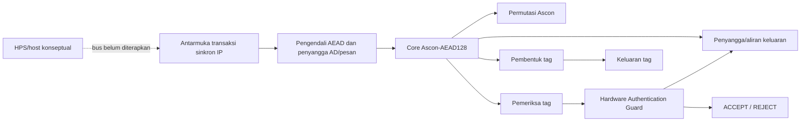
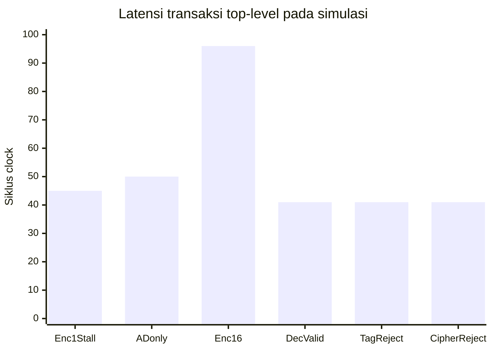

# Draf Proposal SECURE-TINY

**Kategori:** Perancangan Chip IC dan Implementasi FPGA
**Tantangan utama:** Hardware Cryptography Accelerator  
**Tantangan pendukung:** Secure Communication  
**Platform target:** DE10-Nano FPGA/SoC  
**Status dokumen:** Draf proposal teknis; metrik FPGA dan validasi board masih tertunda.

> Draf teknis ini merangkum arsitektur dan status rekayasa SECURE-TINY. Sebelum pengajuan, sesuaikan tata letak dengan format resmi kompetisi dan isi data tim yang memang diminta panitia.

## Pilihan Judul Proyek

1. **SECURE-TINY: Perancangan dan Verifikasi IP Core Ascon-AEAD128 dengan Guard Autentikasi untuk Komunikasi Edge Aman** — paling akurat terhadap RTL dan bukti yang tersedia.
2. **Rancang Bangun Akselerator Kriptografi Ringan Ascon-AEAD128 dengan Pelepasan Plaintext Terproteksi pada FPGA Cyclone V** — menonjolkan jalur data dan pengendalian keluaran dekripsi.
3. **Implementasi IP Authenticated Encryption Berbasis Ascon-AEAD128 untuk Integritas Data pada Perangkat Edge Terbatas** — menekankan use case edge dan fungsi AEAD.

Judul pertama direkomendasikan. Istilah “hemat sumber daya” dapat ditulis sebagai tujuan desain, bukan hasil terukur, sampai laporan Quartus tersedia.

## 1. Ringkasan Eksekutif

Perangkat edge, sensor, dan pengendali tertanam dapat memproses data yang memerlukan kerahasiaan sekaligus pemeriksaan integritas dan autentikasi. Implementasi perangkat lunak menjalankan operasi kriptografi pada prosesor host; SECURE-TINY mengkaji pemindahan fungsi enkripsi terautentikasi ke IP perangkat keras modular yang dapat diverifikasi dan ditargetkan ke FPGA.

SECURE-TINY mengimplementasikan Ascon-AEAD128 berdasarkan NIST SP 800-232 final. IP menerima key, nonce, associated data (AD), dan pesan melalui antarmuka sinkron. Enkripsi menghasilkan ciphertext dan tag autentikasi. Pada dekripsi, calon plaintext ditahan sampai tag diverifikasi. Hardware Authentication Guard menerbitkan ACCEPT atau REJECT dan menahan plaintext bila autentikasi gagal.

Progres terverifikasi mencakup simulasi core RTL terhadap 1.089 rekaman KAT Ascon-C v1.3.0 pada mode enkripsi dan dekripsi (2.178 transaksi), serta simulasi integrasi tingkat atas terhadap 289 pasangan panjang AD/pesan (0–16 byte) pada kedua mode (578 transaksi). Pengujian juga mencakup alur valid/tolak, pemeriksa Python terhadap 14 kasus sampel ACVP NIST dan seluruh 1.089 KAT, uji unit tag/guard, serta sintesis generik Yosys untuk kapasitas 16 byte. Jumlah sel generik bukan pemakaian ALM Cyclone V. Kompilasi Quartus, timing/resource FPGA, pemrograman, dan pengujian board belum dilakukan; antarmuka host HPS/Avalon juga belum tersedia.

Tujuan proyek adalah menghasilkan IP RTL dan bukti verifikasi fungsional serta menyiapkan build FPGA yang dapat diulang. Proyek tidak mengubah algoritma Ascon dan tidak mengklaim validasi sertifikasi atau implementasi tahan side-channel.

## 2. Latar Belakang dan Rumusan Masalah

Keamanan layanan digital dan perangkat edge bergantung pada perlindungan kerahasiaan serta pemeriksaan integritas dan keaslian data. PERURI menjelaskan layanan digital security dan PERURI ID yang menggunakan sertifikat elektronik, autentikasi, dan perlindungan data [8]. Konteks tersebut menunjukkan relevansi aplikasi, tetapi tidak berarti SECURE-TINY sudah menjadi secure element, penyimpan identitas, atau produk PERURI.

NIST menerbitkan SP 800-232 final pada Agustus 2025, yang menstandarkan Ascon-AEAD128 bersama primitif Ascon lainnya untuk perangkat terbatas [1]. Rujukan normatif yang benar adalah **NIST SP 800-232**, bukan SP 800-225; SP 800-225 adalah laporan tahunan cybersecurity/privacy NIST FY2022 [11]. Ascon-AEAD128 cocok sebagai dasar studi IP authenticated encryption: plaintext dienkripsi, sementara tag memverifikasi pesan dan Associated Data (AD) yang tidak perlu dienkripsi.

Pada perangkat edge/IoT yang mengirim data sensor atau perintah, ciphertext saja tidak cukup: penerima juga perlu mengetahui apakah pesan dan metadata terkait berubah. SECURE-TINY menguji pola tersebut dengan IP perangkat keras yang memproses satu transaksi pada satu waktu. Pengendali menampung AD dan pesan, core menjalankan Ascon secara iteratif, dan jalur dekripsi menahan calon plaintext sampai pemeriksaan tag selesai.

### Pemetaan kategori PERURI Chip Hackathon 2026

| Kategori | Posisi SECURE-TINY | Dasar teknis dan batas implementasi |
|---|---|---|
| Secure Identity & Security Element Chip | Relevansi aplikasi, bukan fokus RTL | Dapat mendukung subsistem perlindungan data pada sistem identitas, tetapi tidak menyediakan penyimpanan kunci tahan gangguan, sertifikat, PKI, secure boot, atau lifecycle secure element. |
| Hardware Cryptography Accelerator | **Fokus utama** | Produk yang dibuat adalah IP Ascon-AEAD128 untuk enkripsi/dekripsi terautentikasi dengan core dan pengendali perangkat keras. |
| AI / Edge Accelerator | Bukan fokus | Perangkat edge menjadi konteks aplikasi; proyek ini tidak memiliki jalur data AI atau inferensi jaringan saraf. |
| Secure Communication | **Fokus pendukung** | AEAD melindungi kerahasiaan dan mendeteksi perubahan pesan/AD; protokol jaringan, key exchange, dan stack komunikasi tidak termasuk. |

### Masalah teknis dan batas klaim

- **Sumber daya FPGA/silikon:** permutasi iteratif satu ronde per siklus adalah pilihan arsitektur yang berpotensi menghemat logika ronde dibandingkan penerapan seluruh ronde sekaligus, dengan konsekuensi latensi. Penghematan belum dibuktikan; ALM/register/Fmax Quartus masih TBD. Angka Yosys generik tidak dapat dipakai sebagai angka Cyclone V.
- **Perubahan ciphertext/tag:** testbench tingkat atas menguji tag dan ciphertext yang diubah; transaksi ditolak dan tidak ada plaintext valid yang keluar. Ini adalah perlindungan fungsional terhadap data yang tidak terautentikasi, bukan pendeteksian gangguan fisik pada chip.
- **Serangan timing side-channel:** belum ada penanggulangan side-channel atau evaluasi waktu konstan. Jumlah siklus dipengaruhi panjang transaksi dan handshake, sehingga proyek tidak mengklaim menghilangkan serangan timing. Konsumsi daya/EM dan injeksi kesalahan juga belum diuji.
- **Isolasi/penghapusan aman:** guard menghalangi pelepasan plaintext melalui antarmuka saat verifikasi gagal. Penghapusan aman penyangga/state, sensor gangguan fisik, serta isolasi terhadap kesalahan fisik belum diterapkan atau diverifikasi.

Rumusan masalah:

> Bagaimana merancang IP perangkat keras Ascon-AEAD128 yang modular dan dapat diuji, memastikan dekripsi gagal tidak melepaskan plaintext sebelum autentikasi berhasil, serta mengukur penggunaan sumber daya dan kinerja pada target FPGA?

Fokus rekayasa adalah kebenaran fungsional, antarmuka kendali yang jelas, perlindungan keluaran dekripsi, dan pengukuran. Klaim penghematan sumber daya atau percepatan dibandingkan perangkat lunak belum dibuat karena laporan FPGA dan tolok ukur perangkat lunak pembanding belum tersedia.

## 3. Solusi, Keunggulan, dan Arsitektur

Solusi berupa IP perangkat keras iteratif, dengan satu ronde permutasi per siklus aktif. Tahap awal memakai kapasitas terbatas dan penyangga internal agar alur dapat diverifikasi tanpa bus host yang rumit. AD dan pesan masuk satu byte per handshake; pengendali memulai core setelah seluruh masukan transaksi diterima.

Fokus rekayasa SECURE-TINY:

1. Memisahkan permutasi, core AEAD, pengendali, penanganan tag, guard autentikasi, dan modul tingkat atas.
2. Membuktikan penerimaan tag valid serta penolakan tag/data yang berubah tanpa transfer plaintext.
3. Menyediakan sinyal kendali/status yang dapat diamati melalui simulasi dan waveform.
4. Menyiapkan proyek Quartus untuk perangkat target dan mengukur penggunaan sumber daya/timing setelah perangkat lunak vendor tersedia.

Ini adalah fokus arsitektur proyek, bukan klaim algoritma baru atau klaim pertama, terkecil, maupun tercepat.



### Alur transaksi

- Satu transaksi diproses pada satu waktu. `start` diterima saat `busy=0`; `done` berupa pulsa satu siklus.
- AD dan pesan memakai antarmuka selebar satu byte dengan `valid/ready`. Panjang perintah menentukan jumlah byte; tidak ada sinyal `last`.
- Parameter `MAX_DATA_BYTES` membatasi panjang AD dan pesan secara terpisah. Profil Quartus saat ini menggunakan 16 byte untuk masing-masing; testbench core memakai 32 byte agar mencakup rentang panjang KAT.
- Enkripsi mengeluarkan ciphertext lalu tag; tag ditahan sampai `tag_ready`.
- Dekripsi memverifikasi tag sebelum mengizinkan transfer plaintext. Tag tidak cocok menghasilkan REJECT tanpa keluaran plaintext valid.
- Reset sinkron aktif-rendah membatalkan transaksi.

Modul tingkat atas adalah IP sinkron sederhana, belum berupa bus host produksi. Port transaksi di QSF saat ini menggunakan pin virtual; tidak ada jalur host fisik untuk demonstrasi transaksi DE10-Nano.

### Modul RTL

| Modul | Tanggung jawab | Bukti saat ini |
|---|---|---|
| `counter.sv` | Contoh pencacah untuk reset/aktifkan/tahan/limpahan; bukan jalur data produk | Testbench pencacah lulus; tidak masuk modul tingkat atas Quartus |
| `ascon_permutation.sv` | Permutasi state dan status ronde/busy/done/error | Simulasi p8/p12 dan kendali lulus |
| `ascon_core.sv` | AEAD dengan penyangga: inisialisasi, AD, pesan, finalisasi, hasil/tag | 1.089 KAT langsung RTL untuk enkripsi dan dekripsi lulus |
| `aead_controller.sv` | Aliran masukan, penyangga, urutan core/verifikasi/keluaran | Pengujian tingkat atas lulus |
| `tag_generator.sv` | Menahan tag sampai handshake ke modul berikutnya | Uji unit handshake/penahanan keluaran lulus |
| `tag_verifier.sv` | Membandingkan seluruh tag 128-bit | Uji unit cocok, ketidakcocokan bit tinggi, masukan tersimpan lulus |
| `authentication_guard.sv` | Keputusan ACCEPT/REJECT dan izin plaintext | Uji unit dan integrasi valid/tolak lulus |
| `secure_tiny_top.sv` | Menggabungkan modul menjadi antarmuka IP sinkron | KAT, handshake, penolakan, reset, batas panjang lulus |

### Pemetaan seluruh testbench

| Berkas | Cakupan |
|---|---|
| `tb/tb_counter.sv` | Reset, aktifkan, tahan, dan limpahan pencacah latihan. |
| `tb/tb_ascon_permutation.sv` | Keluaran p8/p12 dan kendali start/busy/done/error permutasi. |
| `tb/tb_ascon_core.sv` | 1.089 rekaman KAT untuk enkripsi dan dekripsi core (2.178 transaksi; parameter testbench 32 byte). |
| `tb/tb_tag_auth_modules.sv` | Handshake/penahanan keluaran pembentuk tag, kecocokan/ketidakcocokan pemeriksa, dan keputusan guard. |
| `tb/tb_secure_tiny_top.sv` | Uji integrasi: KAT terarah, jeda, reset, start saat sibuk, penolakan, dan batas panjang. |
| `tb/tb_secure_tiny_kat.sv` | 289 pasangan panjang AD/pesan 0–16 byte untuk enkripsi/dekripsi (578 transaksi) melalui aliran data modul tingkat atas. |

### Jalur komunikasi dan handshake

```text
Perintah + aliran AD + aliran pesan/ciphertext
              | valid/ready selebar satu byte
              v
secure_tiny_top -> aead_controller + penyangga masukan
                          | core_start + transaksi packed
                          v
                  ascon_core <---- start/rounds/state ----> ascon_permutation
                    | data/tag terhitung
                    +--> enkripsi: ciphertext out_valid/out_ready -> tag_valid/tag_ready
                    +--> dekripsi: tag_verifier -> authentication_guard -> plaintext yang dijaga
```

Transfer byte terjadi pada tepi naik clock ketika `valid && ready`. Pengendali menyimpan perintah saat `start` diterima ketika tidak sibuk, mengumpulkan AD terlebih dahulu lalu pesan, dan baru memulai core setelah seluruh byte diterima. Core mengendalikan permutasi melalui start, jumlah ronde, dan state; permutasi mengembalikan state beserta status busy/done. Saat enkripsi, ciphertext dikirim terlebih dahulu lalu tag ditahan sampai `tag_ready`. Saat dekripsi, seluruh calon plaintext ditahan sampai pemeriksa selesai; guard hanya mengizinkan keluaran setelah tag cocok. Jika tag tidak cocok, pengendali menolak transaksi tanpa mentransfer plaintext. Antarmuka ini belum menggunakan AXI/Avalon/HPS.

## 4. Target FPGA dan Estimasi Sumber Daya

Target proyek Quartus: **DE10-Nano, Cyclone V SoC `5CSEBA6U23I7`**, clock board `FPGA_CLK1_50` dengan batas SDC 20 ns (50 MHz). Ini adalah batas konfigurasi, bukan bukti bahwa desain telah memenuhi timing 50 MHz.

| Metrik | Status draf | Cara memperoleh hasil target |
|---|---|---|
| Logic Elements / ALM Cyclone V | **TBD — belum diukur** | Kompilasi Quartus dan laporan Fitter/penggunaan sumber daya |
| Flip-flop FPGA | **TBD — belum diukur** | Laporan Quartus setelah sintesis/Fitter |
| M10K / block RAM | **TBD — belum diukur** | Laporan Quartus |
| DSP | **TBD — belum diukur** | Laporan Quartus |
| Fmax dan slack timing | **TBD — belum diukur** | Timing Analyzer setelah kompilasi dengan SDC |
| Berkas `.sof` | **Belum dibuat** | Quartus Assembler setelah kompilasi berhasil |
| Pengujian board | **Belum dilakukan** | Memerlukan DE10-Nano, berkas pemrograman, dan antarmuka transaksi yang dapat diakses |

Sintesis generik Yosys mencatat 20.887 sel untuk `MAX_DATA_BYTES=16`, dengan `check` tanpa masalah. Jumlah tersebut **bukan** estimasi ALM/LE Cyclone V dan tidak digunakan sebagai angka resource FPGA. Percobaan pemetaan Cyclone V melalui backend Yosys berhenti pada assertion internal ABC9 dan tidak menghasilkan angka yang sah. Antarmuka host belum dibuat, sehingga pin virtual hanya menyiapkan proyek untuk dikompilasi, bukan untuk akses transaksi dari HPS.

### Langkah Quartus Prime Lite dan otomasi metrik

Intel mencantumkan Cyclone V sebagai keluarga perangkat yang didukung Quartus Prime Lite [9]. Pasang Quartus Prime Lite beserta dukungan perangkat Cyclone V untuk `5CSEBA6U23I7`. Langkah melalui antarmuka grafis:

1. Buka `quartus/secure_tiny.qpf`; periksa top-level `secure_tiny_top`, device, sumber RTL, dan `MAX_DATA_BYTES=16`.
2. Tinjau pin clock/reset dan SDC 50 MHz. Port transaksi saat ini menggunakan pin virtual, sehingga proyek belum dapat berkomunikasi dengan host/board untuk pengujian transaksi.
3. Jalankan **Processing > Start Compilation**. Quartus menjalankan pemetaan dan penempatan/perutean; periksa kesalahan serta peringatan.
4. Buka laporan Fitter untuk ALM/register/memori dan Timing Analyzer untuk Fmax serta slack.
5. Setelah proses fit berhasil, jalankan Assembler untuk membuat berkas pemrograman `.sof`. Keberadaan `.sof` belum membuktikan bahwa board telah diuji.

Perintah otomasi dari direktori utama repositori:

```powershell
powershell.exe -NoProfile -ExecutionPolicy Bypass -File .\scripts\build_quartus_metrics.ps1
```

Jika Quartus tidak berada di `PATH`, berikan direktori `bin64` yang berisi perangkat Quartus:

```powershell
powershell.exe -NoProfile -ExecutionPolicy Bypass -File .\scripts\build_quartus_metrics.ps1 -QuartusBin 'C:\intelFPGA_lite\<versi>\quartus\bin64'
```

Skrip menjalankan pemeriksaan awal, `quartus_map`, `quartus_fit`, dan `quartus_sta`; log disimpan di `quartus/output_files/`. Pengurai mencari kolom ALM, register, dan Fmax clock `FPGA_CLK1_50` dari `.rpt`, lalu menulis `quartus/secure_tiny_metrics.csv` beserta baris bukti. Jika format laporan tidak cocok atau metrik tidak ditemukan, CSV menandainya `UNPARSED`/`NOT_FOUND` dan nilainya tetap TBD. Periksa laporan asli sebelum menggunakan angkanya di proposal. Skrip ini tidak menjalankan `quartus_asm` dan tidak mengklaim membuat `.sof`.

## 5. Perangkat Lunak dan Alat

- OSS CAD Suite Windows: paket tool lokal untuk simulasi dan sintesis generik.
- Icarus Verilog dan `vvp`: kompilasi/menjalankan testbench SystemVerilog.
- GTKWave: pemeriksaan VCD.
- Yosys: sintesis generik dan pemeriksaan hierarki/netlist.
- Python: model referensi dan pembanding vektor.
- Intel Quartus Prime Lite Edition: mendukung Cyclone V; diperlukan untuk kompilasi target, tetapi belum tersedia saat hasil terakhir dicatat.
- VS Code dan Git: penyunting serta pengelola versi proyek.

Versi yang tercatat: Icarus `14.0 (devel) (s20260301-500-g2e81fcccb-dirty)` dan Yosys `0.69+156` (`9d0c91b23-dirty`). Rincian sumber/hash vektor tercantum di `docs/results.md`.

## 6. Rencana dan Hasil Pengujian

### Rencana pengujian

1. Kompilasi dan simulasi counter serta permutasi.
2. Bandingkan core RTL dengan KAT enkripsi/dekripsi.
3. Uji pembentuk/pemeriksa/guard secara unit: handshake, penahanan keluaran, cocok/tidak cocok, reset, dan izin plaintext.
4. Uji integrasi: AD saja, pesan parsial dan satu blok penuh, jeda, start saat sibuk, reset, batas panjang, tag salah, dan ciphertext berubah.
5. Periksa VCD untuk clock/reset, handshake, status core, keluaran, tag, serta keputusan autentikasi.
6. Jalankan sintesis generik dan pemeriksaan awal proyek; setelah Quartus tersedia, kompilasi Cyclone V dan catat laporan resource/timing. Pengujian board menunggu antarmuka transaksi yang dapat diakses.

### Hasil pengukuran saat draf

| Pengujian | Hasil |
|---|---|
| Permutasi | p8/p12 dan kontrol: PASS |
| Core RTL dibandingkan dengan KAT Ascon-C v1.3.0 | 1.089 rekaman × enkripsi/dekripsi = 2.178 transaksi lulus; total 121.308 siklus; maksimum 88 siklus/transaksi; kapasitas uji 32 byte |
| Unit tag/authentication guard | Handshake pembentuk tag, pembanding penuh, keputusan terima/tolak/reset: lulus |
| Modul tingkat atas | KAT, jeda, AD saja, pesan 16 byte, dekripsi valid, penolakan tag/ciphertext, start saat sibuk, reset di fase penerimaan/core/verifikasi/pengiriman data/pengiriman tag, serta AD/data melebihi kapasitas: lulus |
| Model Python dibandingkan dengan sampel NIST ACVP | 14 kasus berukuran kelipatan byte: lulus |
| Model Python dibandingkan dengan KAT Ascon-C | 1.089 rekaman, enkripsi/dekripsi: lulus |
| Sapuan KAT pasangan panjang tingkat atas | 289 pasangan panjang (0–16 byte) untuk enkripsi/dekripsi; 578 transaksi lulus |
| Sintesis generik Yosys, kapasitas 16 | 20.887 sel generik; `check` menemukan nol masalah |
| Quartus dan perangkat keras | Belum dijalankan/belum dilakukan |

Enam skenario terarah modul tingkat atas mencatat 45, 50, 96, 41, 41, dan 41 siklus. Sapuan KAT tingkat atas menjalankan 578 transaksi dengan total 51.019 siklus dan maksimum 150 siklus per transaksi; rentang ini mencakup pengiriman masukan byte melalui handshake. Angka tersebut merupakan hasil simulasi, bukan throughput kontinu atau hasil timing FPGA.



Grafik merangkum kasus tingkat atas yang berbeda beserta pola handshake masing-masing; gunakan angka hanya sebagai hasil skenario testbench. Ini bukan pengukuran timing FPGA atau throughput kontinu.

## 7. Kriteria Keberhasilan dan Batas Klaim

**Tercapai pada tingkat simulasi:** seluruh 1.089 rekaman KAT Ascon-C yang dipakai cocok pada core RTL untuk enkripsi/dekripsi; skenario tingkat atas yang diuji menerima tag valid dan menolak tag/ciphertext yang diubah tanpa mengeluarkan plaintext; rangkaian uji otomatis lulus; proyek Quartus lolos pemeriksaan awal statis.

**Belum tercapai:** kompilasi Quartus, angka penggunaan sumber daya/timing Cyclone V, berkas pemrograman, transaksi dari host/pin nyata, dan demonstrasi DE10-Nano. Angka FPGA hanya boleh diisi berdasarkan laporan Quartus aktual. Proyek ini tidak mengklaim sertifikasi kriptografi, ketahanan terhadap side-channel/injeksi kesalahan, konsumsi daya, atau percepatan dibandingkan perangkat lunak.

## 8. Rencana Kerja

| Tahap | Deliverable | Status |
|---|---|---|
| RTL permutasi dan core | Modul yang dapat disintesis, testbench, KAT | Lulus berdasarkan bukti yang dicatat |
| Pengendali AEAD dan guard | Integrasi, penolakan tanpa plaintext, uji unit/integrasi | Lulus pada skenario yang diuji |
| Paket build FPGA | QPF/QSF/SDC, pemeriksaan awal, skrip build | Berkas siap; pemeriksaan awal lulus; kompilasi menunggu Quartus |
| Analisis sumber daya/timing | Laporan Cyclone V aktual | Tertunda hingga Quartus tersedia |
| Antarmuka host dan demonstrasi | Pembungkus HPS/Avalon atau pin yang dipilih, pengujian board | Tertunda hingga antarmuka dirancang dan board tersedia |


## 9. Referensi Ilmiah dan Teknis

1. M. Sönmez Turan, K. McKay, J. Kang, J. Kelsey, dan D. Chang, **Ascon-Based Lightweight Cryptography Standards for Constrained Devices: Authenticated Encryption, Hash, and Extendable Output Functions**, NIST SP 800-232, Aug. 2025. [Halaman NIST](https://csrc.nist.gov/pubs/sp/800/232/final), [PDF resmi](https://nvlpubs.nist.gov/nistpubs/SpecialPublications/NIST.SP.800-232.pdf), doi: [10.6028/NIST.SP.800-232](https://doi.org/10.6028/NIST.SP.800-232).
2. NIST, **Lightweight Cryptography Standardization Process: NIST Selects Ascon**, pengumuman pemilihan Ascon untuk standardisasi. [NIST](https://www.nist.gov/news-events/news/2023/02/lightweight-cryptography-standardization-process-nist-selects-ascon); daftar publikasi proyek [NIST CSRC](https://csrc.nist.gov/Projects/lightweight-cryptography/publications).
3. NIST ACVP Server, [Ascon-AEAD128 SP800-232 sample vectors](https://github.com/usnistgov/ACVP-Server/tree/master/gen-val/json-files/Ascon-AEAD128-SP800-232). Vektor lokal merupakan subset sampel, bukan bukti validasi sertifikasi ACVP.
4. Ascon Team, [ascon-c v1.3.0](https://github.com/ascon/ascon-c/tree/v1.3.0), sumber supplemental `LWC_AEAD_KAT_128_128.txt`; hash lokal dicatat di `docs/results.md`.
5. Terasic, [DE10-Nano product page and user manual](https://www.terasic.com.tw/cgi-bin/page/archive.pl?CategoryNo=204&Language=English&No=1046&PartNo=4).
6. Intel, [Panduan Pengguna Quartus Prime: Memulai](https://www.intel.com/content/www/us/en/docs/programmable/683475.html), dokumentasi proyek dan alur kompilasi FPGA.
7. [Icarus Verilog documentation](https://steveicarus.github.io/iverilog/) dan [Yosys documentation](https://yosyshq.readthedocs.io/projects/yosys/en/latest/).

8. PERURI, [Solusi Keamanan untuk Transaksi Elektronik dan PERURI ID](https://www.peruri.co.id/business-pillar/digital-security/digital-product). Referensi konteks aplikasi, bukan requirement teknis chip SECURE-TINY.
9. Intel, [Quartus Prime editions and supported devices](https://www.intel.com/content/www/us/en/products/details/fpga/development-tools/quartus-prime/resource.html), informasi dukungan Cyclone V pada Lite Edition.
10. Intel, [Sumber daya baris perintah dan skrip Tcl Quartus Prime](https://www.intel.com/content/www/us/en/support/programmable/support-resources/design-guidance/quartus-support.html), dokumentasi alur baris perintah dan pembuatan laporan melalui skrip.
11. NIST, [SP 800-225: Fiscal Year 2022 Cybersecurity and Privacy Annual Report](https://csrc.nist.gov/pubs/sp/800/225/final). Ini bukan standar Ascon; standar Ascon yang dipakai proyek adalah SP 800-232 [1].

Tanggal akses rujukan daring: 1 Oktober 2026.

## 10. Lampiran dan Bukti

VCD dibuat otomatis oleh testbench. Sertakan tabel hasil/latensi, identitas/hash vektor, VCD, ringkasan log Yosys generik dengan label yang benar, berkas QPF/QSF/SDC, dan hasil pemeriksaan awal. Jangan menyajikan jumlah sel generik sebagai ALM Cyclone V.

### Tangkapan layar manual GTKWave

Jalankan `scripts/run_all_tests.ps1`, buka waveform dengan GTKWave, pilih sinyal yang ditentukan, perbesar tampilan satu transaksi, lalu ambil tangkapan layar yang menampilkan nama sinyal dan skala waktu.

1. `sim/ascon_permutation.vcd`: `clk`, `rst_n`, `start`, `rounds`, `busy`, `done`, `error`, `state_in`, `state_out`; tampilkan transaksi p8 atau p12.
2. `sim/ascon_core.vcd`: `clk`, `rst_n`, `start`, `decrypt`, `busy`, `done`, `ad_length`, `data_length`, `data_out`, `tag_out`, dan `dut.phase`. Berkas mencatat transaksi awal; seluruh 2.178 hasil KAT dirangkum di log terminal.
3. `sim/tag_auth_modules.vcd`: `tag_load`, `tag_valid`, `tag_ready`, `tag_out`, `verify_start`, `verify_busy`, `verify_done`, `tag_match`, `tag_mismatch`, `decision_valid`, `decision_match`, `auth_result_valid`, `accept`, `reject`, `plaintext_allowed`.
4. `sim/secure_tiny_top.vcd`: `clk`, `rst_n`, `start`, `decrypt`, `busy`, `data_valid`, `data_ready`, `data_in`, `out_valid`, `out_ready`, `out_data`, `tag_valid`, `tag_ready`, `auth_result_valid`, `accept`, `reject`, `done`. Tambahkan `dut.controller.verifier_done`, `dut.controller.verifier_match`, `dut.controller.plaintext_allowed`, dan `dut.controller.phase` jika tersedia pada hierarki.

Untuk sapuan berbagai panjang, buka `sim/secure_tiny_kat.vcd` dengan sinyal serupa; VCD hanya menyimpan transaksi awal sebagai contoh, sedangkan hasil seluruh 578 transaksi tersedia pada keluaran skrip pengujian.

Untuk bukti terminal, tampilkan perintah yang dijalankan serta baris PASS, jumlah KAT, dan latensi. Tangkapan layar laporan resource baru dapat ditambahkan setelah Quartus menghasilkan laporan.

### Demonstrasi dan bootcamp (opsional dalam templat)

- **Demonstrasi langsung DE10-Nano:** belum dilakukan; memerlukan kompilasi Quartus, berkas pemrograman, dan antarmuka transaksi board.
