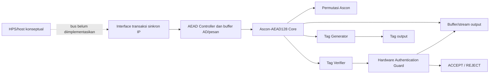
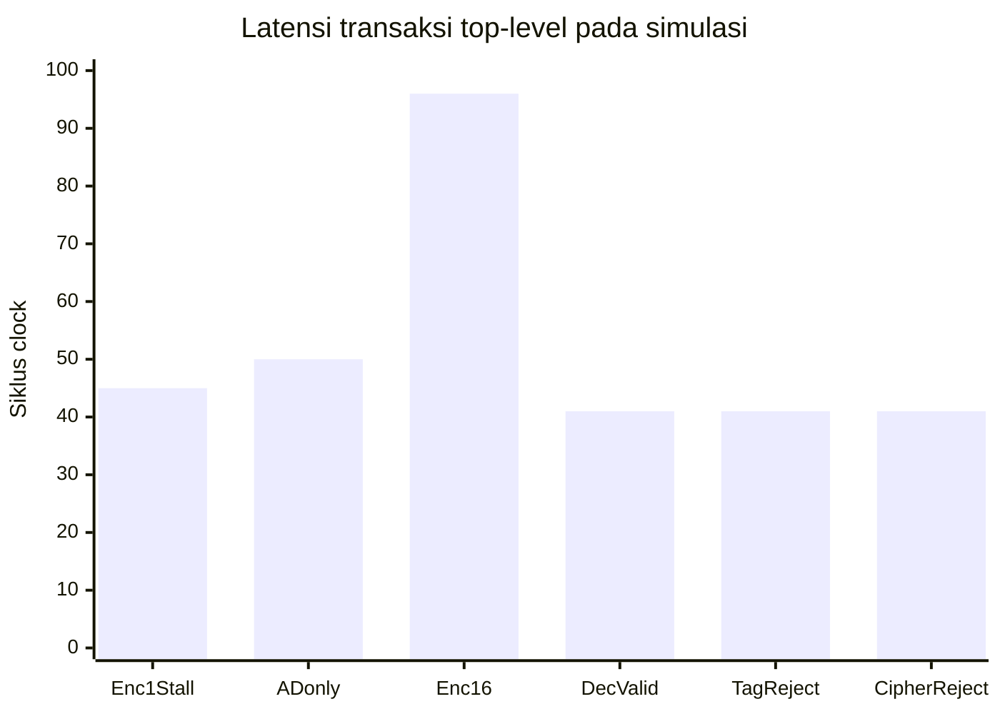

# Draf Proposal SECURE-TINY

**Kategori:** IC Chip Design & FPGA Implementation  
**Tantangan utama:** Hardware Cryptography Accelerator  
**Tantangan pendukung:** Secure Communication  
**Platform target:** DE10-Nano FPGA/SoC  
**Status dokumen:** Draf proposal teknis; metrik FPGA dan validasi board masih pending.

> Draf teknis ini merangkum arsitektur dan status rekayasa SECURE-TINY. Sebelum pengajuan, sesuaikan tata letak dengan format resmi kompetisi dan isi data tim yang memang diminta panitia.

## Pilihan Judul Proyek

1. **SECURE-TINY: Perancangan dan Verifikasi IP Core Ascon-AEAD128 dengan Guard Autentikasi untuk Komunikasi Edge Aman** — paling akurat terhadap RTL dan bukti yang tersedia.
2. **Rancang Bangun Akselerator Kriptografi Ringan Ascon-AEAD128 dengan Pelepasan Plaintext Terproteksi pada FPGA Cyclone V** — menonjolkan datapath dan pengendalian keluaran dekripsi.
3. **Implementasi IP Authenticated Encryption Berbasis Ascon-AEAD128 untuk Integritas Data pada Perangkat Edge Terbatas** — menekankan use case edge dan fungsi AEAD.

Judul pertama direkomendasikan. Istilah “hemat sumber daya” dapat ditulis sebagai tujuan desain, bukan hasil terukur, sampai laporan Quartus tersedia.

## 1. Ringkasan Ide (Executive Summary)

Perangkat edge, sensor, dan pengendali tertanam dapat memproses data yang memerlukan kerahasiaan sekaligus pemeriksaan integritas dan autentikasi. Implementasi perangkat lunak menjalankan operasi kriptografi pada prosesor host; SECURE-TINY mengkaji pemindahan fungsi authenticated encryption ke IP hardware modular yang dapat diverifikasi dan ditargetkan ke FPGA.

SECURE-TINY mengimplementasikan Ascon-AEAD128 berdasarkan NIST SP 800-232 final. IP menerima key, nonce, associated data (AD), dan pesan melalui interface sinkron. Enkripsi menghasilkan ciphertext dan authentication tag. Pada dekripsi, calon plaintext ditahan sampai tag diverifikasi. Hardware Authentication Guard menerbitkan ACCEPT atau REJECT dan menahan plaintext bila autentikasi gagal.

Progres terverifikasi mencakup simulasi core RTL terhadap 1.089 record KAT Ascon-C v1.3.0 pada mode enkripsi dan dekripsi (2.178 transaksi), serta simulasi integrasi top-level terhadap 289 pasangan panjang AD/pesan (0–16 byte) pada kedua mode (578 transaksi). Pengujian juga mencakup alur valid/reject, checker Python terhadap 14 kasus sampel ACVP NIST dan semua 1.089 KAT, uji unit tag/guard, serta sintesis generik Yosys untuk kapasitas 16 byte. Jumlah sel generik bukan pemakaian ALM Cyclone V. Compile Quartus, timing/resource FPGA, pemrograman dan uji papan belum dilakukan; interface host HPS/Avalon juga belum tersedia.

Tujuan proyek adalah menghasilkan IP RTL dan bukti verifikasi fungsional serta menyiapkan build FPGA yang dapat diulang. Proyek tidak mengubah algoritma Ascon dan tidak mengklaim validasi sertifikasi atau implementasi tahan side-channel.

## 2. Latar Belakang dan Rumusan Masalah

Keamanan layanan digital dan perangkat edge bergantung pada perlindungan kerahasiaan serta pemeriksaan integritas dan keaslian data. PERURI menjelaskan layanan digital security dan PERURI ID yang menggunakan sertifikat elektronik, autentikasi, dan perlindungan data [8]. Konteks tersebut menunjukkan relevansi aplikasi, tetapi tidak berarti SECURE-TINY sudah menjadi secure element, penyimpan identitas, atau produk PERURI.

NIST menerbitkan SP 800-232 final pada Agustus 2025, yang menstandarkan Ascon-AEAD128 bersama primitif Ascon lainnya untuk perangkat terbatas [1]. Rujukan normatif yang benar adalah **NIST SP 800-232**, bukan SP 800-225; SP 800-225 adalah laporan tahunan cybersecurity/privacy NIST FY2022 [11]. Ascon-AEAD128 cocok sebagai dasar studi IP authenticated encryption: plaintext dienkripsi, sementara tag memverifikasi pesan dan Associated Data (AD) yang tidak perlu dienkripsi.

Pada perangkat edge/IoT yang mengirim data sensor atau command, ciphertext saja tidak cukup: penerima juga perlu mengetahui apakah pesan dan metadata terkait berubah. SECURE-TINY menguji pola tersebut dengan hardware IP yang memproses satu transaksi pada satu waktu. Controller membuffer AD dan pesan, core menjalankan Ascon secara iteratif, dan jalur dekripsi menahan calon plaintext sampai pemeriksaan tag selesai.

### Pemetaan kategori PERURI Chip Hackathon 2026

| Kategori | Posisi SECURE-TINY | Dasar teknis dan batas implementasi |
|---|---|---|
| Secure Identity & Security Element Chip | Relevansi aplikasi, bukan fokus RTL | Dapat mendukung subsistem perlindungan data pada sistem identitas, tetapi tidak menyediakan penyimpanan kunci tahan gangguan, sertifikat, PKI, secure boot, atau lifecycle secure element. |
| Hardware Cryptography Accelerator | **Fokus utama** | Produk yang dibuat adalah IP Ascon-AEAD128 untuk enkripsi/dekripsi terautentikasi dengan core dan controller hardware. |
| AI / Edge Accelerator | Bukan fokus | Perangkat edge menjadi konteks aplikasi; tidak ada datapath AI atau inferensi neural network. |
| Secure Communication | **Fokus pendukung** | AEAD melindungi kerahasiaan dan mendeteksi perubahan pesan/AD; protokol jaringan, key exchange, dan stack komunikasi tidak termasuk. |

### Masalah teknis dan batas klaim

- **Resource FPGA/silikon:** permutasi iteratif satu ronde per siklus adalah pilihan arsitektur yang berpotensi menghemat logika ronde dibanding unrolling penuh, dengan trade-off latency. Penghematan belum dibuktikan; ALM/register/Fmax Quartus masih TBD. Angka Yosys generik tidak dapat dipakai sebagai angka Cyclone V.
- **Perubahan ciphertext/tag:** testbench top-level menguji tag dan ciphertext yang diubah; transaksi ditolak dan tidak ada plaintext yang valid keluar. Ini adalah perlindungan fungsional terhadap data yang tidak terautentikasi, bukan deteksi tampering fisik pada chip.
- **Side-channel timing:** belum ada countermeasure side-channel atau evaluasi constant-time. Jumlah siklus dipengaruhi panjang transaksi dan handshake, sehingga proyek tidak mengklaim menghilangkan timing attack. Konsumsi daya/EM dan fault injection juga belum diuji.
- **Isolasi/zeroization:** guard menghalangi pelepasan plaintext melalui interface saat verifikasi gagal. Penghapusan aman buffer/state, tamper sensor, serta isolasi terhadap fault fisik belum diimplementasikan atau diverifikasi.

Rumusan masalah:

> Bagaimana merancang IP hardware Ascon-AEAD128 yang modular dan dapat diuji, serta memastikan dekripsi gagal tidak pernah melepaskan plaintext sebelum autentikasi berhasil, sambil mengukur biaya resource dan kinerja pada target FPGA?

Fokus rekayasa adalah kebenaran fungsional, antarmuka kontrol yang jelas, perlindungan keluaran dekripsi, dan pengukuran. Klaim hemat resource atau percepatan terhadap software belum dibuat karena laporan FPGA dan benchmark software pembanding belum tersedia.

## 3. Solusi, Keunggulan, dan Arsitektur

Solusi berupa hardware IP iteratif, dengan satu ronde permutasi per siklus aktif. Tahap awal memakai kapasitas terbatas dan buffer internal agar alur dapat diverifikasi tanpa bus host kompleks. AD dan pesan masuk satu byte per handshake; controller memulai core setelah seluruh input transaksi diterima.

Fokus rekayasa SECURE-TINY:

1. Memisahkan permutasi, core AEAD, controller, penanganan tag, guard autentikasi, dan top-level.
2. Membuktikan penerimaan tag valid serta penolakan tag/data yang berubah tanpa transfer plaintext.
3. Menyediakan sinyal kontrol/status yang dapat diamati melalui simulasi dan waveform.
4. Menyiapkan proyek Quartus untuk device target dan mengukur resource/timing setelah tool vendor tersedia.

Ini adalah fokus arsitektur proyek, bukan klaim algoritma baru atau klaim pertama, terkecil, maupun tercepat.



### Alur transaksi

- Satu transaksi diproses pada satu waktu. `start` diterima saat `busy=0`; `done` berupa pulsa satu siklus.
- AD dan pesan memakai interface byte-wide `valid/ready`. Panjang command menentukan jumlah byte; tidak ada sinyal `last`.
- Parameter `MAX_DATA_BYTES` membatasi panjang AD dan pesan secara terpisah. Profil Quartus saat ini menggunakan 16 byte untuk masing-masing; testbench core memakai 32 byte agar mencakup rentang panjang KAT.
- Enkripsi mengeluarkan ciphertext lalu tag; tag ditahan sampai `tag_ready`.
- Dekripsi memverifikasi tag sebelum mengizinkan transfer plaintext. Tag tidak cocok menghasilkan REJECT tanpa keluaran plaintext valid.
- Reset sinkron aktif-rendah membatalkan transaksi.

Top-level adalah IP sinkron sederhana, belum berupa bus host produksi. Port transaksi di QSF saat ini menggunakan virtual pins; tidak ada jalur host fisik untuk demo transaksi DE10-Nano.

### Modul RTL

| Modul | Tanggung jawab | Bukti saat ini |
|---|---|---|
| `counter.sv` | Counter contoh untuk reset/enable/hold/wrap; bukan datapath produk | Testbench counter PASS; tidak masuk top-level Quartus |
| `ascon_permutation.sv` | Permutasi state dan status ronde/busy/done/error | Simulasi p8/p12 dan kontrol PASS |
| `ascon_core.sv` | AEAD buffered: inisialisasi, AD, pesan, finalisasi, hasil/tag | 1.089 KAT langsung RTL untuk enkripsi dan dekripsi PASS |
| `aead_controller.sv` | Input stream, buffer, urutan core/verifikasi/output | Pengujian top-level PASS |
| `tag_generator.sv` | Menahan tag sampai handshake downstream | Uji unit handshake/backpressure PASS |
| `tag_verifier.sv` | Membandingkan tag 128-bit penuh | Uji unit match, mismatch bit tinggi, input latched PASS |
| `authentication_guard.sv` | Keputusan ACCEPT/REJECT dan izin plaintext | Uji unit dan integrasi valid/reject PASS |
| `secure_tiny_top.sv` | Menggabungkan modul menjadi interface IP sinkron | KAT, handshake, reject, reset, batas panjang PASS |

### Pemetaan seluruh testbench

| Berkas | Cakupan |
|---|---|
| `tb/tb_counter.sv` | Reset, enable, hold, wrap counter latihan. |
| `tb/tb_ascon_permutation.sv` | Output p8/p12 dan kontrol start/busy/done/error permutasi. |
| `tb/tb_ascon_core.sv` | 1.089 record KAT untuk enkripsi dan dekripsi core (2.178 transaksi; parameter testbench 32 byte). |
| `tb/tb_tag_auth_modules.sv` | Handshake/backpressure tag generator, match/mismatch verifier, dan keputusan guard. |
| `tb/tb_secure_tiny_top.sv` | Uji integrasi: KAT terarah, stall, reset, start saat busy, reject dan batas panjang. |
| `tb/tb_secure_tiny_kat.sv` | 289 pasangan panjang AD/pesan 0–16 byte dalam mode encrypt/decrypt (578 transaksi) melalui stream top-level. |

### Jalur komunikasi dan handshake

```text
Command + AD stream + message/ciphertext stream
              | valid/ready byte-wide
              v
secure_tiny_top -> aead_controller + input buffers
                          | core_start + packed transaction
                          v
                  ascon_core <---- start/rounds/state ----> ascon_permutation
                    | computed data/tag
                    +--> encrypt: ciphertext out_valid/out_ready -> tag_valid/tag_ready
                    +--> decrypt: tag_verifier -> authentication_guard -> gated plaintext
```

Transfer byte terjadi di tepi naik clock ketika `valid && ready`. Controller menyimpan command ketika `start` diterima saat idle, mengumpulkan AD dahulu lalu pesan, dan baru memulai core setelah seluruh byte diterima. Core mengendalikan permutasi melalui start, jumlah ronde, dan state; permutasi mengembalikan state beserta status busy/done. Saat enkripsi, ciphertext dikonsumsi dahulu lalu tag ditahan sampai `tag_ready`. Saat dekripsi, seluruh calon plaintext ditahan sampai verifier selesai; guard hanya mengizinkan output setelah match. Pada mismatch controller menolak transaksi tanpa transfer plaintext. Interface ini belum menggunakan AXI/Avalon/HPS.

## 4. Target FPGA dan Estimasi Resource

Target project Quartus: **DE10-Nano, Cyclone V SoC `5CSEBA6U23I7`**, clock board `FPGA_CLK1_50` dengan constraint SDC 20 ns (50 MHz). Ini adalah constraint konfigurasi, bukan bukti desain telah memenuhi timing 50 MHz.

| Metrik | Status draf | Cara memperoleh hasil target |
|---|---|---|
| Logic Elements / ALM Cyclone V | **TBD — belum diukur** | Compile Quartus dan laporan Fitter/Resource Usage |
| Flip-flop FPGA | **TBD — belum diukur** | Laporan Quartus setelah synthesis/fitter |
| M10K / block RAM | **TBD — belum diukur** | Laporan Quartus |
| DSP | **TBD — belum diukur** | Laporan Quartus |
| Fmax dan slack timing | **TBD — belum diukur** | Timing Analyzer setelah compile dengan SDC |
| File `.sof` | **Belum dibuat** | Quartus Assembler setelah compile berhasil |
| Uji papan | **Belum dilakukan** | Memerlukan DE10-Nano, programming file, dan interface transaksi yang dapat diakses |

Yosys sintesis generik mencatat 20.887 sel untuk `MAX_DATA_BYTES=16`, dengan `check` tanpa masalah. Jumlah tersebut **bukan** estimasi ALM/LE Cyclone V dan tidak digunakan sebagai angka resource FPGA. Percobaan pemetaan Cyclone V via backend Yosys berhenti pada internal assertion ABC9 dan tidak menghasilkan angka valid. Host interface belum dibuat, sehingga virtual pins hanya menyiapkan project untuk compile, bukan akses transaksi dari HPS.

### Langkah Quartus Prime Lite dan otomasi metrik

Intel mencantumkan Cyclone V sebagai keluarga device yang didukung Quartus Prime Lite [9]. Pasang Quartus Prime Lite dan dukungan device Cyclone V untuk `5CSEBA6U23I7`. Alur GUI:

1. Buka `quartus/secure_tiny.qpf`; periksa top-level `secure_tiny_top`, device, sumber RTL, dan `MAX_DATA_BYTES=16`.
2. Tinjau pin clock/reset dan SDC 50 MHz. Transaction ports saat ini virtual pins, sehingga project belum dapat berkomunikasi dengan host/board untuk uji transaksi.
3. Jalankan **Processing > Start Compilation**. Quartus menjalankan map dan fit; periksa error serta warning.
4. Buka laporan Fitter untuk ALM/register/memori dan Timing Analyzer untuk Fmax serta slack.
5. Setelah fit berhasil, jalankan Assembler untuk membuat file pemrograman `.sof`. Keberadaan `.sof` belum membuktikan board telah diuji.

Perintah automation dari root repo:

```powershell
powershell.exe -NoProfile -ExecutionPolicy Bypass -File .\scripts\build_quartus_metrics.ps1
```

Jika Quartus tidak berada di `PATH`, berikan direktori `bin64` yang berisi tools:

```powershell
powershell.exe -NoProfile -ExecutionPolicy Bypass -File .\scripts\build_quartus_metrics.ps1 -QuartusBin 'C:\intelFPGA_lite\<versi>\quartus\bin64'
```

Runner menjalankan preflight, `quartus_map`, `quartus_fit`, dan `quartus_sta`; log disimpan di `quartus/output_files/`. Parser mencari field ALM, register, dan Fmax clock `FPGA_CLK1_50` dari `.rpt`, lalu menulis `quartus/secure_tiny_metrics.csv` beserta baris bukti. Jika format report tidak cocok atau metrik tidak ditemukan, CSV menandainya `UNPARSED`/`NOT_FOUND` dan nilainya tetap TBD. Periksa report asli sebelum memakai angka dalam proposal. Runner ini tidak menjalankan `quartus_asm` dan tidak mengklaim membuat `.sof`.

## 5. Perangkat Lunak dan Tools

- OSS CAD Suite Windows: paket tool lokal untuk simulasi dan sintesis generik.
- Icarus Verilog dan `vvp`: compile/run testbench SystemVerilog.
- GTKWave: inspeksi VCD.
- Yosys: sintesis generik dan pemeriksaan hierarchy/netlist.
- Python: model referensi dan pembanding vector.
- Intel Quartus Prime Lite Edition: mendukung Cyclone V; diperlukan untuk compile target, tetapi belum tersedia saat hasil terakhir dicatat.
- VS Code dan Git: editor serta version control proyek.

Versi yang tercatat: Icarus `14.0 (devel) (s20260301-500-g2e81fcccb-dirty)` dan Yosys `0.69+156` (`9d0c91b23-dirty`). Rincian sumber/hash vector terdapat di `docs/results.md`.

## 6. Rencana dan Hasil Pengujian

### Rencana pengujian

1. Compile dan simulasi counter serta permutasi.
2. Bandingkan core RTL dengan KAT enkripsi/dekripsi.
3. Uji generator/verifier/guard secara unit: handshake, backpressure, match/mismatch, reset, dan izin plaintext.
4. Uji integrasi: AD-only, pesan parsial dan satu blok penuh, stall, start saat busy, reset, batas panjang, tag salah, dan ciphertext berubah.
5. Inspeksi VCD untuk clock/reset, handshake, status core, output, tag, serta keputusan autentikasi.
6. Jalankan sintesis generik dan preflight project; setelah Quartus tersedia, compile Cyclone V dan rekam laporan resource/timing. Uji papan menunggu interface transaksi yang dapat diakses.

### Hasil terukur saat draf

| Pengujian | Hasil |
|---|---|
| Permutasi | p8/p12 dan kontrol: PASS |
| Core RTL vs Ascon-C v1.3.0 KAT | 1.089 record × enkripsi/dekripsi = 2.178 transaksi PASS; total 121.308 siklus; maksimum 88 siklus/transaksi; kapasitas uji 32 byte |
| Unit tag/authentication guard | Generator handshake, verifier full-width, guard accept/reject/reset: PASS |
| Top-level | KAT, stall, AD-only, pesan 16 byte, valid decrypt, reject tag/ciphertext, start saat busy, reset di fase receive/core/verifikasi/send-data/send-tag, serta AD/data oversized: PASS |
| Model Python vs sampel NIST ACVP | 14 kasus byte-aligned: PASS |
| Model Python vs Ascon-C KAT | 1.089 record, enkripsi/dekripsi: PASS |
| Top-level KAT length-pair sweep | 289 pasangan panjang (0–16 byte) untuk encrypt/decrypt; 578 transaksi PASS |
| Yosys sintesis generik, capacity 16 | 20.887 sel generik; `check` menemukan nol masalah |
| Quartus dan hardware | Belum dijalankan/belum dilakukan |

Enam skenario top-level directed mencatat 45, 50, 96, 41, 41, dan 41 siklus. Sweep KAT top-level menjalankan 578 transaksi dengan total 51.019 siklus dan maksimum 150 siklus per transaksi; rentang ini mencakup pengiriman input byte melalui handshake. Angka tersebut adalah hasil simulasi, bukan throughput kontinu atau hasil timing FPGA.



Grafik merangkum kasus top-level yang berbeda dan pola handshake masing-masing; bandingkan hanya sebagai hasil skenario testbench. Ini bukan pengukuran timing FPGA atau throughput kontinu.

## 7. Kriteria Keberhasilan dan Batas Klaim

**Tercapai pada level simulasi:** seluruh 1.089 record KAT Ascon-C yang dipakai cocok di core RTL untuk enkripsi/dekripsi; skenario top-level yang diuji menerima tag valid dan menolak tag/ciphertext yang dimodifikasi tanpa plaintext; suite otomatis lulus; project Quartus lolos preflight statis.

**Belum tercapai:** compile Quartus, angka resource/timing Cyclone V, programming file, transaksi dari host/pin nyata, dan demonstrasi DE10-Nano. Angka FPGA hanya boleh diisi dari laporan Quartus aktual. Proyek ini tidak mengklaim sertifikasi kriptografi, ketahanan side-channel/fault-injection, daya, atau percepatan software.

## 8. Rencana Kerja

| Tahap | Deliverable | Status |
|---|---|---|
| RTL permutasi dan core | Modul synthesizable, testbench, KAT | PASS pada bukti yang dicatat |
| AEAD controller dan guard | Integrasi, reject tanpa plaintext, unit/integration tests | PASS pada skenario yang diuji |
| Paket build FPGA | QPF/QSF/SDC, preflight, skrip build | File siap; preflight PASS; compile menunggu Quartus |
| Analisis resource/timing | Laporan Cyclone V aktual | Pending Quartus |
| Interface host dan demo | Wrapper HPS/Avalon atau pin yang dipilih, uji papan | Pending desain interface dan board access |


## 9. Referensi Ilmiah dan Teknis

1. M. Sönmez Turan, K. McKay, J. Kang, J. Kelsey, dan D. Chang, **Ascon-Based Lightweight Cryptography Standards for Constrained Devices: Authenticated Encryption, Hash, and Extendable Output Functions**, NIST SP 800-232, Aug. 2025. [Halaman NIST](https://csrc.nist.gov/pubs/sp/800/232/final), [PDF resmi](https://nvlpubs.nist.gov/nistpubs/SpecialPublications/NIST.SP.800-232.pdf), doi: [10.6028/NIST.SP.800-232](https://doi.org/10.6028/NIST.SP.800-232).
2. NIST, **Lightweight Cryptography Standardization Process: NIST Selects Ascon**, pengumuman pemilihan Ascon untuk standardisasi. [NIST](https://www.nist.gov/news-events/news/2023/02/lightweight-cryptography-standardization-process-nist-selects-ascon); daftar publikasi proyek [NIST CSRC](https://csrc.nist.gov/Projects/lightweight-cryptography/publications).
3. NIST ACVP Server, [Ascon-AEAD128 SP800-232 sample vectors](https://github.com/usnistgov/ACVP-Server/tree/master/gen-val/json-files/Ascon-AEAD128-SP800-232). Vektor lokal merupakan subset sampel, bukan bukti validasi sertifikasi ACVP.
4. Ascon Team, [ascon-c v1.3.0](https://github.com/ascon/ascon-c/tree/v1.3.0), sumber supplemental `LWC_AEAD_KAT_128_128.txt`; hash lokal dicatat di `docs/results.md`.
5. Terasic, [DE10-Nano product page and user manual](https://www.terasic.com.tw/cgi-bin/page/archive.pl?CategoryNo=204&Language=English&No=1046&PartNo=4).
6. Intel, [Quartus Prime User Guide: Getting Started](https://www.intel.com/content/www/us/en/docs/programmable/683475.html), dokumentasi project dan alur compile FPGA.
7. [Icarus Verilog documentation](https://steveicarus.github.io/iverilog/) dan [Yosys documentation](https://yosyshq.readthedocs.io/projects/yosys/en/latest/).

8. PERURI, [Solusi Keamanan untuk Transaksi Elektronik dan PERURI ID](https://www.peruri.co.id/business-pillar/digital-security/digital-product). Referensi konteks aplikasi, bukan requirement teknis chip SECURE-TINY.
9. Intel, [Quartus Prime editions and supported devices](https://www.intel.com/content/www/us/en/products/details/fpga/development-tools/quartus-prime/resource.html), informasi dukungan Cyclone V pada Lite Edition.
10. Intel, [Quartus Prime command-line and Tcl scripting resources](https://www.intel.com/content/www/us/en/support/programmable/support-resources/design-guidance/quartus-support.html), dokumentasi alur command-line dan report scripting.
11. NIST, [SP 800-225: Fiscal Year 2022 Cybersecurity and Privacy Annual Report](https://csrc.nist.gov/pubs/sp/800/225/final). Ini bukan standar Ascon; standar Ascon yang dipakai proyek adalah SP 800-232 [1].

Tanggal akses referensi daring: 1 Oktober 2026.

## 10. Lampiran dan Bukti

VCD dibuat otomatis oleh testbench. Sertakan tabel PASS/latensi, identitas/hash vector, VCD, ringkasan log Yosys generik dengan label yang benar, berkas QPF/QSF/SDC, dan hasil preflight. Jangan menampilkan jumlah sel generik sebagai ALM Cyclone V.

### Screenshot manual GTKWave

Jalankan `scripts/run_all_tests.ps1`, buka waveform dengan GTKWave, pilih sinyal yang ditentukan, zoom satu transaksi, dan ambil screenshot yang menampilkan nama sinyal serta skala waktu.

1. `sim/ascon_permutation.vcd`: `clk`, `rst_n`, `start`, `rounds`, `busy`, `done`, `error`, `state_in`, `state_out`; tampilkan transaksi p8 atau p12.
2. `sim/ascon_core.vcd`: `clk`, `rst_n`, `start`, `decrypt`, `busy`, `done`, `ad_length`, `data_length`, `data_out`, `tag_out`, dan `dut.phase`. File mencatat transaksi awal; seluruh 2.178 hasil KAT direkap di log terminal.
3. `sim/tag_auth_modules.vcd`: `tag_load`, `tag_valid`, `tag_ready`, `tag_out`, `verify_start`, `verify_busy`, `verify_done`, `tag_match`, `tag_mismatch`, `decision_valid`, `decision_match`, `auth_result_valid`, `accept`, `reject`, `plaintext_allowed`.
4. `sim/secure_tiny_top.vcd`: `clk`, `rst_n`, `start`, `decrypt`, `busy`, `data_valid`, `data_ready`, `data_in`, `out_valid`, `out_ready`, `out_data`, `tag_valid`, `tag_ready`, `auth_result_valid`, `accept`, `reject`, `done`. Tambahkan `dut.controller.verifier_done`, `dut.controller.verifier_match`, `dut.controller.plaintext_allowed`, dan `dut.controller.phase` jika tersedia di hierarchy.

Untuk sweep lintas-panjang, buka `sim/secure_tiny_kat.vcd` dengan sinyal serupa; VCD hanya menyimpan transaksi awal sebagai contoh, sedangkan hasil semua 578 transaksi ada di output runner.

Untuk bukti terminal, tampilkan command yang dijalankan serta baris PASS, jumlah KAT dan latensi. Screenshot laporan resource hanya dapat ditambahkan setelah Quartus menghasilkan laporan.

### Demo dan bootcamp (opsional di template)

- **Demo live DE10-Nano:** belum dilakukan; memerlukan compile Quartus, programming file, dan interface transaksi papan.
